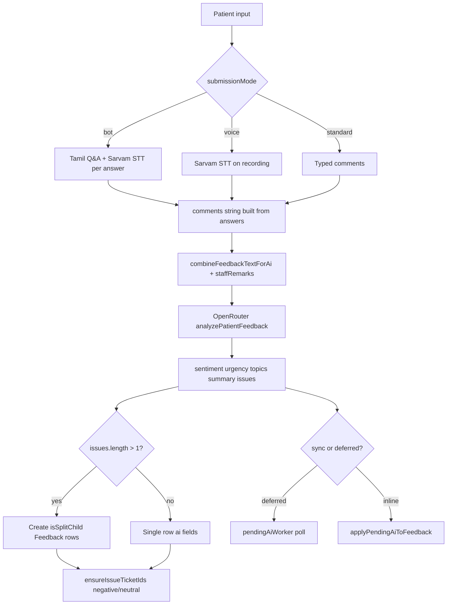
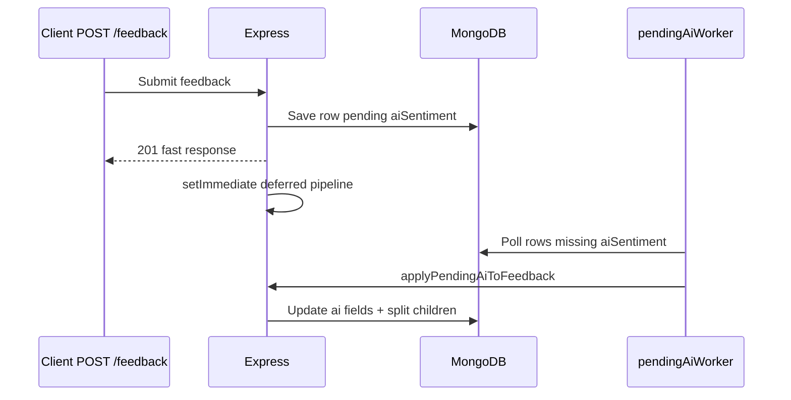

# AI Engineering

**Related:** [[Software Architecture]] · [[Performance]] · [[Problem Solving]] · [[Backend Engineering]]

---

## Two AI Systems in One Engineer

| Dimension | Iink | MAPIMS |
|-----------|------|--------|
| Primary modality | Vision-language (page images) | Text + speech (Tamil/English) |
| Model host | Local GPU / vLLM / Chandra GGUF | OpenRouter API (Gemini 2.5 Flash Lite default) |
| Output | Layout JSON / markdown | Sentiment, urgency, topics, issues[], summary |
| Secondary AI | Alt-text VL, scene labels | Voice rating inference, dept/service hint resolve |
| Evaluation | Human Neural Review | HOD queue + admin analytics |
| Vector/RAG | None | None |

---

## MAPIMS AI Pipeline

**No RAG, no embeddings, no agent loop** — single-shot structured JSON extraction per submission.

---

## Model Selection — MAPIMS

| Function | Model route | Why |
|----------|-------------|-----|
| Full feedback analysis | `OPENROUTER_MODEL` default `google/gemini-2.5-flash-lite` | Cost/latency for high volume hospital feedback |
| Voice rating | Same client, separate prompt | One API integration; simpler ops |
| Dept/service hint | `resolveServiceHintWithOpenRouter` | Catalog too large for rules alone |
| STT | Sarvam (`SARVAM_STT_MODEL`) | Tamil hospital domain |

**Fallback chain:** Heuristic `resolveDepartmentHeuristic()` → OpenRouter hint → exact catalog match.

---

## Prompt Engineering — MAPIMS

**Files:** `openRouterPrompts.js`, `openRouterAnalysis.js`

| Technique | Implementation | Why |
|-----------|----------------|-----|
| JSON-only system prompt | `SYSTEM_JSON_ONLY` | Parseable downstream; no markdown leakage |
| XML compact user prompt | `<feedback>`, `<catalog>` tags | Token budget vs prose |
| Pipe-separated catalogs | Dept/service lists in prompt | Fewer tokens than JSON arrays |
| Multi-issue cap | Max 8 issues | Prevent runaway split tickets |
| Tamil rules | Explicit in analysis prompt | Bot transcripts are Tamil-heavy |
| Typo repair | `parseModelJson()` LLM typo fix | Production JSON occasionally malformed |

**Post-AI cleanup:** `filterAiTopicsForTranscript()` — remove "waiting time" topic unless transcript mentions waiting (Tamil `காத்து` disambiguation).

---

## Split Tickets & Sentiment Logic

**Business rules encoded in code:**

- `canOpenTicketForSentiment()` — tickets for **negative + neutral**, not positive
- Rating 1 → immediate ticket (`critical_immediate`)
- Rating 2 → ticket after 24h + 2+ patients (`normal_after_24h_multi_patient`)
- Each AI issue → potential child row with own `ticketId`, dept, service, HOD mapping

**Materialization:** `materializeMissingSplitChildrenForParent()`, `repairAllMissingSplitChildren()` — backfill for legacy rows.

**Display enrichment:** Parent bot/voice data merged into children at read — avoids duplicating `.webm` files.

---

## Deferred AI Architecture

**Why:** OpenRouter latency (seconds) must not block kiosk thank-you screen or staff form.

**Worker config:** `PENDING_AI_POLL_SECONDS`, `PENDING_AI_BATCH_SIZE`, `PENDING_AI_MIN_AGE_SECONDS`.

---

## Iink AI (Retained)

Vision-language OCR pipeline — see original vault content:

- dots.mocr / vLLM / Chandra routing via `ocr_runtime`
- Prompt modes: `prompt_iink_layout_en`, text-only, scene spotting
- OCR disk cache with fingerprint
- Salvage on JSON parse failure

Full detail unchanged — [[Performance]] cross-links both.

---

## Speech / NLP — MAPIMS

| Component | Role |
|-----------|------|
| `sarvamSpeech.js` | Parse Sarvam STT response shapes |
| `POST /api/speech-to-text` | Kiosk mic → transcript |
| `POST /api/feedback/infer-voice-rating` | Transcript → 1–5 rating |
| Bot conversation | Pre-recorded Tamil MP3 + per-answer `.webm` |
| `buildBotCommentsFromAnswers()` | Flatten Q&A to `comments` for AI |

**Not classical NLP stack** — LLM does understanding; STT is external API.

---

## Evaluation Strategy — Both Projects

| Project | Method | Gap |
|---------|--------|-----|
| Iink | Processing CSV timings, human Neural Review | No CER/layout IoU |
| MAPIMS | Admin analytics aggregates, ticket queue | No prompt regression suite |
| MAPIMS | Maintenance scripts (`reanalyzePendingFeedback.js`) | Manual batch, not CI |

**Maturity pattern:** Operational scripts + human review > automated ML metrics.

---

## Why These Approaches — MAPIMS

| Decision | Reason |
|----------|--------|
| OpenRouter vs self-host | No GPU ops burden for hospital deploy |
| Split child documents vs array-only | Each issue assignable to different HOD independently |
| Strip `comments` in lite API | Bot transcript = MB-scale; list views need summaries only |
| Deferred worker vs sync | UX latency on submit path |
| Gemini Flash Lite default | Volume hospital feedback; cost control |

---

## Not Present (Both Projects)

- Fine-tuning / LoRA
- Embeddings + vector retrieval
- Multi-agent tool orchestration
- Automated A/B prompt testing
- Model observability (LangSmith, etc.)

See [[Learning Roadmap]].
