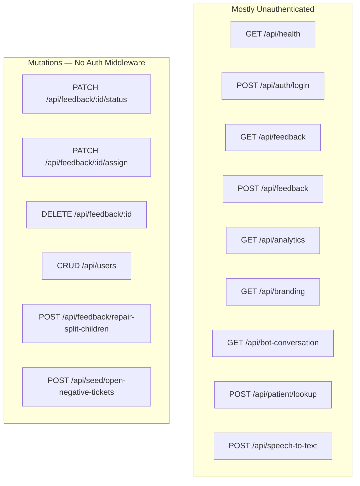

# API Design

**Related:** [[Backend Engineering]] · [[Security]] · [[Software Architecture]] · [[Performance]]

---

## API Styles — Both Projects

| Style | Iink | MAPIMS |
|-------|------|--------|
| Primary | REST JSON + SSE | REST JSON |
| Long jobs | `POST .../process_stream` SSE | Deferred worker (no SSE) |
| Upload | Multipart PDF | Multipart voice + bot answers |
| Auth | Session cookie | Login JSON → client storage |
| Static | `/api/project/.../file` | `/uploads/*` |

---

## MAPIMS Route Map

---

## List API Contract — MAPIMS (Critical Design)

`GET /api/feedback` query parameters:

| Param | Purpose |
|-------|---------|
| `lite=1` | Strip `botConversationAnswers`, voice URLs, bulky `comments` if `aiSummary` exists |
| `startMs` + `endMs` | Insights date window |
| `encounter` | op / ip / op-ip / name-only filter |
| `sinceMs` | Delta sync — rows with `updatedAt >= sinceMs` |
| `assignedToUserId` | HOD queue — server-side filter |

**Built by:** `buildFeedbackInsightsFilter()` in `insightsFeedbackQuery.js`

**Response shaping:** `toFeedbackListRow()` — list/detail split is intentional API design.

**Detail:** `GET /api/feedback/:id` — full record including transcripts and audio URLs for ticket detail dialog.

---

## Design Principles — MAPIMS

### 1. Lite list, heavy detail
List endpoints must never ship bot transcripts. Detail on demand when user opens ticket.

### 2. Incremental sync as first-class query
`sinceMs` turns full reload into delta — requires `updatedAt` index and client merge logic.

### 3. Role-aware query params over client filter
HOD uses `assignedToUserId` — **don't download 8000 rows to show 2**.

### 4. Idempotent create
`clientSubmissionId` in POST body — unique partial index prevents duplicate from offline outbox retry.

### 5. Repair as explicit POST
`/api/feedback/repair-split-children` — operational backfill, not magic migration.

---

## Iink API Principles (Retained)

- SSE progress protocol with keepalive + cancel
- `no_create=1` on layout GET — read without side effects
- Role-gated `process_stream` (super_admin only)
- Query params for export variants (`use_mathml`, `raw`)

---

## Request/Response Patterns — MAPIMS

| Pattern | Example |
|---------|---------|
| Success list | `FeedbackItem[]` JSON array |
| Success single | Full feedback document |
| Error | `{ message: "..." }` |
| Analytics | `{ totals, byStatus, submissionsByDay, ... }` |
| Login | User object without password hash |
| Health | `{ ok, openRouterConfigured }` |

**Gap:** No consistent error code enum; no OpenAPI spec.

---

## Frontend API Client

**File:** `frontend/src/app/lib/api.ts`

- `fetchFeedback(query)` — builds query string from `FeedbackInsightsQuery`
- All reads: `cache: "no-store"` — browser HTTP cache disabled intentionally; app cache is in-memory Map
- `getFeedbackById(id)` — detail fetch for dialogs
- **No Authorization headers** — session not sent to API

**Sync layer:** `feedbackListSync.ts`
- `FEEDBACK_SYNC_OVERLAP_MS = 15000` — clock skew safety
- `mergeFeedbackLists` — upsert by `_id`

---

## Idempotency & Safety

| Operation | Idempotency |
|-----------|-------------|
| POST feedback with `clientSubmissionId` | Yes — duplicate → 409 |
| Voice upload same path | Skip rewrite if exists |
| PATCH status | Last write wins |
| repair-split-children | Safe to rerun — scans and creates missing |
| seed open-negative-tickets | Batch update — rerunnable |

---

## Versioning

No `/v1` prefix on either project — single evolving API consumed by one SPA each.

---

## Replication Checklist — MAPIMS API

1. **Always offer `lite` on list endpoints** when records contain nested media/transcripts
2. **Add `updatedAt` + `sinceMs`** before building client cache
3. **Put role filters in query string**, not client filter
4. **Detail endpoint** for anything stripped from list
5. **Document overlap window** for delta sync (15s here)
6. **Add auth middleware** before production — see [[Security]]

---

## Replication Checklist — Iink API

1. Long jobs → SSE + cancel + keepalive
2. Separate status poll for reconnect
3. Gate process separately from read
4. Return artifact paths in completion event
