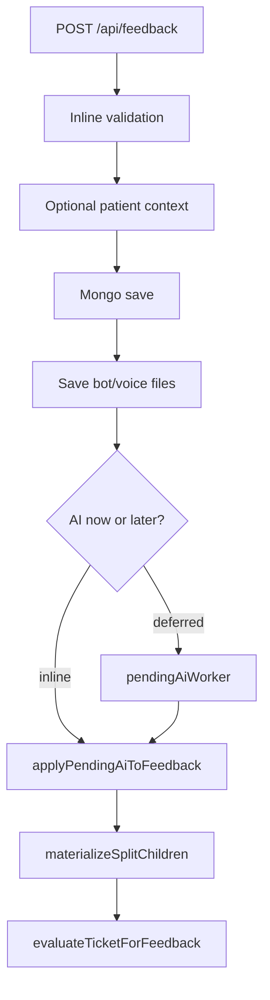

# Backend Engineering

**Related:** [[Software Architecture]] · [[API Design]] · [[Database Engineering]] · [[Security]] · [[Debugging]]

---

## Stack Comparison

| Component | Iink | MAPIMS |
|-----------|------|--------|
| Framework | FastAPI + Flask legacy | Express 5 (ES modules) |
| Runtime | Python 3, uvicorn workers=1 | Node 20 Alpine |
| ODM | pymongo direct | Mongoose 8 |
| Auth | Session cookie + Depends | POST login → JSON; **no middleware** |
| Uploads | Multipart PDF | Multer memory 60–80 MB |
| Long jobs | SSE generator thread | Deferred `setImmediate` + poller |
| Static files | Route handlers | `express.static` `/uploads` + CORS Range |

---

## MAPIMS Business Logic Placement



**Core files:**
- `index.js` — routes + orchestration
- `feedbackIssueProcessing.js` — `evaluateTicketForFeedback`, `buildComplaintSignature`, `newTicketId`
- `openRouterAnalysis.js` — external LLM calls
- `pendingAiWorker.js` — background poller
- `botConversation.js` — bot config + sentiment helpers

---

## Authentication & Authorization — MAPIMS

**Auth:**
- `POST /api/auth/login` — bcrypt compare, returns user JSON
- Frontend stores in `localStorage` (`feedback_auth_session`)
- **No JWT, no session cookie, no Authorization header on API calls**

**Authorization (intended — frontend only):**
- `AdminGuard` — admin routes
- `StaffGuard` — staff/hod/admin dashboard
- `visibleToHod()` — ticket list filter client-side **plus** server `assignedToUserId` query param

**Gap:** All mutation endpoints unprotected at API layer — see [[Security]].

---

## Iink Auth (Stronger)

- Session cookie + `get_current_user`
- `_require_project_access` with write/process flags
- Workflow write lock on `submitted` / `in_review`

MAPIMS should adopt this pattern — backend middleware mirroring frontend guards.

---

## Validation — MAPIMS

Per-route inline (no Zod/Joi):

- Required: `patientName`, user `username/password/role`
- Enums: `role`, `status`, `submissionMode`, `patientEncounterType`
- Length caps: `regNo` ≤ 80, `staffRemarks` ≤ 2000
- ObjectId: `mongoose.Types.ObjectId.isValid`
- HOD assignment: `validateUserAssignment()` — dept **XOR** service for HOD role
- Multer: `LIMIT_FILE_SIZE` → 413

**Style:** Defensive at boundary; permissive inside handlers.

---

## Error Handling — MAPIMS

| Case | Response |
|------|----------|
| Validation | 400 `{ message }` |
| Not found | 404 |
| Duplicate key 11000 | 409 |
| EMR validation | 400 with code |
| EMR timeout | 504 AbortError |
| OpenRouter fail | Log + pending worker retry path |
| Unhandled | 500 + console `[tag]` prefix |

**No global Express error middleware** — duplicated try/catch per route.

**Philosophy:** Fail user-facing paths with message; background AI failures are retriable.

---

## Logging & Observability — MAPIMS

| Mechanism | Purpose |
|-----------|---------|
| Console tags | `[feedback]`, `[openrouter]`, `[patient lookup]`, `[pending-ai]` |
| `/api/health` | Liveness + `openRouterConfigured` flag |
| Maintenance scripts | Batch repair/reanalyze |

**Missing:** Structured JSON logs, request IDs, metrics, APM, audit trail (unlike Iink `audit_logs`).

---

## File Handling — MAPIMS

**Multer:** All memory storage — entire file in RAM before write.

**Layout:**
```
uploads/
  feedback-voice/{id}.webm          # patient voice
  feedback-voice/{id}-q{n}.webm     # bot answers
  feedback-voice/ai_voice/*.mp3     # bot prompts
```

**Docker:** Volume `pfs_uploads_data`; entrypoint copies `uploads-bundled/` with `cp -rn`.

**Serving:** Range-request CORS for audio playback; `attachVoicePlaybackUrl()` adds URLs in JSON.

---

## Background Jobs — MAPIMS

| Job | Mechanism |
|-----|-----------|
| Deferred AI on create | `setImmediate` → `runDeferredFeedbackAiPipeline` |
| Pending AI backfill | `createPendingAiWorker()` interval poll |
| Startup repairs | `repairClientSubmissionIds`, split voice, split children |
| Frontend poll | 30s tickets, 60s admin analytics — visibility-gated |

**No Celery/Bull** — in-process timers only.

---

## EMR Integration

**File:** `emrPatientLookup.js`

- SOAP POST to hospital QueryBuilder `Getdataset1`
- OP + IP stored procedures as SQL strings in request body
- Date literal order configurable (`mdy` / `dmy`) — production SQL Server sensitivity
- `POST /api/patient/lookup` → `{ matches[] }` for kiosk identity picker
- Empty Mongo departments → bootstrap from `listEmrDepartments()`

**Hospital integration pattern:** Read-only EMR bridge; feedback remains system of record.

---

## Code Organization Habits — Both

| Habit | Evidence |
|-------|----------|
| Extract when reused | `insightsFeedbackQuery.js`, `openRouterPrompts.js` |
| Scripts for ops | `backend/scripts/*`, `reanalyzePendingFeedback.js` |
| `.env.example` as contract | Document all integration points |
| Comments on footguns | Transformers pin (Iink); EMR date order (MAPIMS) |
| God file tolerance | `server.py`, `index.js` until pain forces split |

See [[API Design]] for route catalog.
