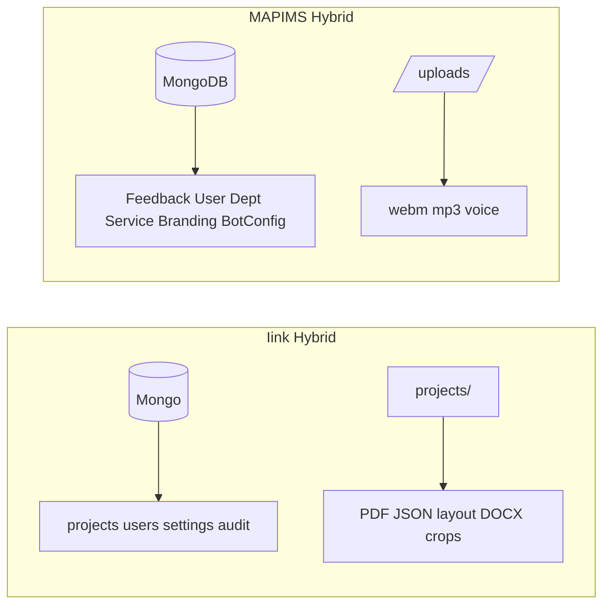
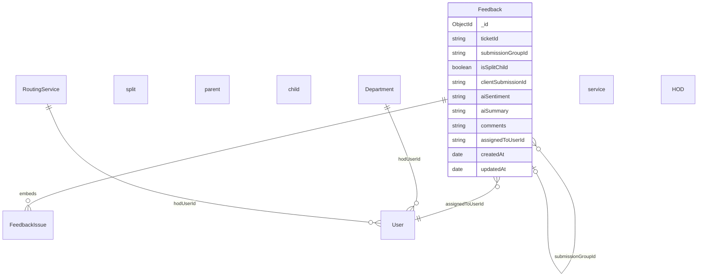

# Database Engineering

**Related:** [[Backend Engineering]] · [[Security]] · [[Software Architecture]] · [[Performance]]

---

## Storage Models — Side by Side



Both avoid GridFS — **Mongo for records, disk for blobs**.

---

## MAPIMS Collections

**File:** `backend/src/models.js`

| Model | Purpose | Key constraints |
|-------|---------|-----------------|
| `Department` | Hospital visit departments | `name` unique; nested `services[]`; `hodUserId` |
| `RoutingService` | AI routing catalog ("services") | `name` unique; `hodUserId` |
| `User` | admin / staff / hod | `username` unique; bcrypt hash; dept OR service for HOD |
| `Feedback` | Submission + ticket document | Large schema; split-child pattern |
| `Branding` | UI theme + voice limits | Single doc `key: global` |
| `BotConversationConfig` | Tamil bot questions | Single doc `key: default` |

---

## Feedback Schema — MAPIMS (Core Design)



**Split ticket pattern:**
- Parent holds `feedbackIssues[]` array from AI
- Children (`isSplitChild: true`) are **first-class rows** with own `ticketId`, assignee, status
- Linked by `submissionGroupId` — enables per-issue HOD routing

**Why not embed-only issues:** Admin tickets page assigns different HODs per split issue; SQL-style row operations (`PATCH status`, `PATCH assign`) need stable `_id`.

---

## Indexes — MAPIMS

```javascript
// models.js — Feedback
{ createdAt: -1 }
{ createdAt: -1, patientEncounterType: 1 }
{ updatedAt: -1 }                    // enables sinceMs delta sync
{ clientSubmissionId: 1 } unique partial  // offline idempotency
```

Field-level indexes: `lookupDepartment`, `submissionGroupId`, `complaintSignature`, `ticketId`, `tmsTicketId`.

**Startup:** `repairClientSubmissionIds()` drops legacy index, `syncIndexes()`.

**Query patterns:**
- Insights window: `{ createdAt: { $gte, $lte }, patientEncounterType? }`
- Delta sync: `{ updatedAt: { $gte: sinceMs } }`
- HOD queue: `{ assignedToUserId: ObjectId }`

---

## Iink Collections (Retained)

- `projects` — embedded submissions, chunks, workflow
- `users`, `system_settings`, `audit_logs`
- **Gap:** Few explicit indexes in app code

MAPIMS is **ahead on indexing** for list/delta queries — `updatedAt` added specifically for incremental sync.

---

## Normalization — MAPIMS

| Choice | Rationale |
|--------|-----------|
| Embed `feedbackIssues[]` on parent | AI output atomic with submission |
| Separate child `Feedback` docs | Independent ticket lifecycle |
| Denormalize `assignedToUsername` | Avoid join on every list row |
| Freeze `lookupDepartment` on submit | EMR value at time of feedback — analytics stable |
| `complaintSignature` | Dedup / ticket correlation |

---

## Transactions & Integrity — MAPIMS

- **No multi-document transactions**
- Split child creation + parent update — eventual consistency via repair endpoints
- `POST /api/feedback/repair-split-children` — admin backfill tool
- Delete user clears HOD mappings — application-level cascade
- Voice upload idempotent — skip if `voiceRecordingRelPath` exists

**Risk:** Partial failure during split materialization → repair scripts as safety net (same pattern as Iink layout save side-effects).

---

## Migration Strategy — Both

| Project | Mechanism |
|---------|-----------|
| Iink | `_migrate_project_folder_names()`, Docker env → Mongo |
| MAPIMS | Startup `repair*()` functions, maintenance scripts |
| MAPIMS | No schema version field — evolutionary documents |

**Pattern:** Runtime repair over formal migrations — fast for solo/small team; risky at scale.

---

## Data Integrity Patterns — MAPIMS

| Pattern | Purpose |
|---------|---------|
| `clientSubmissionId` unique partial | Offline outbox retry without duplicate rows |
| `updatedAt` touch on mutations | Delta sync correctness |
| `lite` response strips `comments` when `aiSummary` exists | List payload integrity (summary is display truth) |
| `enrichFeedbackWithGroupDonor` | Read-time consistency for split children |
| `mergeFeedbackLists` client upsert by `_id` | Incremental sync merge semantics |

---

## Query Optimization Applied (MAPIMS Session)

Observed engineering iteration on this project:

1. Full `GET /feedback` → multi-MB — **problem**
2. Add `lite=1` — strip bot answers + voice URLs
3. Add `sinceMs` + `updatedAt` index — delta only
4. Add `assignedToUserId` filter — HOD doesn't download hospital-wide data
5. Frontend `feedbackCache` — remount without full reload

See [[Performance]] and [[API Design]].

---

## TMS Fields (Future / Stub)

Schema includes `tmsTicketId`, `tmsTicketNumber`, `tmsTicketUrl`, `tmsSyncedAt` — docker-compose env references TMS but **no outbound client implemented**. Database ready; integration pending.
