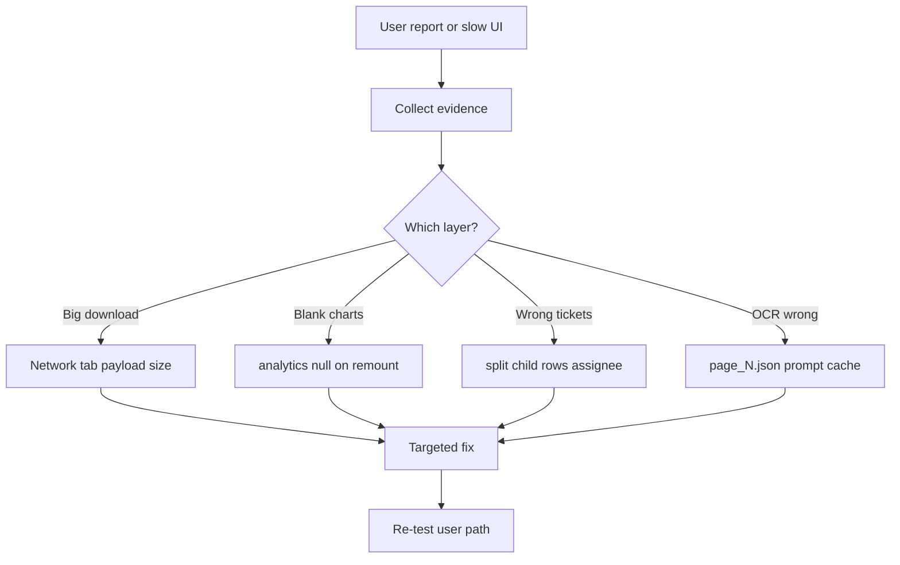

# Debugging Methodology

**Related:** [[Problem Solving]] · [[Engineering Profile]] · [[Backend Engineering]] · [[Performance]]

---

## Unified Debug Style

You debug **production-shaped systems** with **observable evidence** — Network tab, processing CSV, Mongo query scope, artifact files — not only stack traces.

---

## MAPIMS Debugging Patterns (This Project)

### 1. Network tab first
**Observed workflow in conversation:**
- User screenshots DevTools → identify `feedback?lite=1` at 7–8 MB
- Conclude: not "2 tickets slow" — **downloading entire hospital dataset**
- Fix: server filter + cache, not UI spinner tweak

**Signature:** Measure bytes before optimizing React.

### 2. Separate list vs detail payloads
Symptom: table shows full Tamil transcript.
- Trace: `Dashboard.tsx` rendering `item.comments`
- Fix: show `aiSummary` only; detail dialog calls `getFeedbackById`

### 3. Remount vs refetch
Symptom: Insights reloads on tab switch.
- Trace: React Router unmounts `InsightsHub` → `useEffect` full fetch
- Fix: module-level `feedbackCache` + silent incremental refresh

### 4. Cache miss on wrong key
Symptom: Overview slow despite Insights cache.
- Trace: different query keys — Insights uses date window; Overview uses 30-day scope
- Fix: separate cache entries per key + `analyticsCache`

### 5. Charts empty but KPIs show numbers
Symptom: blank chart cards, numbers from `items` fallback.
- Trace: `analytics` null on remount; silent path skipped analytics fetch
- Fix: restore `analyticsCache` on mount

### 6. Split ticket drift
Symptom: one issue, one HOD expected; two departments seen.
- Trace: `feedbackIssues[]` vs `isSplitChild` rows
- Fix: `repair-split-children`, `buildFlatTicketGroups`

---

## Iink Debugging Patterns (Retained)

1. **Split pipeline stages** — processing CSV step timings
2. **Mode bisection** — text-only vs layout_full vs vLLM
3. **Cache fingerprint** — stale `page_N.json`
4. **SSE vs UI** — stream paint, tab visibility canvas refresh
5. **Salvage paths** — partial JSON recovery signals

---

## How You Test Assumptions

| Assumption | MAPIMS verification | Iink verification |
|------------|---------------------|-------------------|
| Cache working | Network shows `sinceMs` not full reload | N/A |
| Lite stripping size | Compare response MB with/without lite | N/A |
| HOD filter | Query string includes `assignedToUserId` | N/A |
| AI applied | `aiSentiment` field populated | `page_N.json` exists |
| EMR reachable | `npm run test-emr-lookup` | N/A |
| OpenRouter configured | `/api/health` flag | `/api/system/runtime` |

**Gap both projects:** No automated regression — manual reproduction dominates.

---

## How You Verify Fixes

**MAPIMS:**
- Rebuild Docker `docker compose up -d --build`
- Repeat user navigation path (Insights → Overview → Insights)
- Confirm Network: small delta requests
- Confirm UI: no "Loading…" when cache warm

**Iink:**
- Re-run page with `force_process`
- Compare processing log timings
- Hard refresh after JS changes

**Preferred verification:** Exact user-reported path, not isolated unit test.

---

## Debug Tooling

| Tool | MAPIMS | Iink |
|------|--------|------|
| Browser Network tab | Primary | Secondary |
| Console tags | `[feedback]`, `[openrouter]` | traceback |
| `/api/health` | OpenRouter flag | runtime endpoint |
| Maintenance scripts | reanalyze, repair | force reprocess |
| Docker logs | backend container | uvicorn stdout |
| Agent transcripts | Iteration history | N/A |

**Missing both:** request IDs, structured logs, pytest, staging metrics dashboard.

---

## Signature Debug Mindset

> **Follow the bytes and the boundary.**  
> MAPIMS: list API → cache → role filter → display field choice.  
> Iink: inference → cache → matcher → export artifact.

See [[Problem Solving]] for task decomposition habits.
