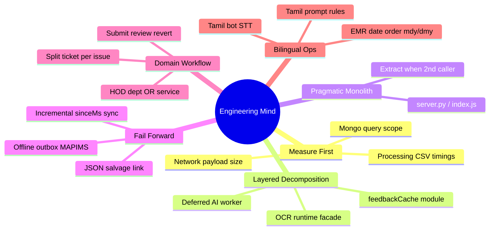

# Engineering Profile — UNIVERSO Reverse Engineering

> Reconstructed from **Iink** (VL document OCR) and **MAPIMS Patient Feedback System** (hospital AI feedback + ticket routing).

**Related:** [[Software Architecture]] · [[AI Engineering]] · [[Backend Engineering]] · [[Skill Matrix]] · [[Weaknesses]] · [[Learning Roadmap]]

---

## Identity

You build **applied AI systems in regulated operational contexts**, not demos. Evidence spans:

| Project | What you ship |
|---------|---------------|
| **Iink** | PDF → VL layout JSON → human Neural Review → XML/HTML/DOCX export |
| **MAPIMS** | Patient feedback (Tamil bot/voice/typed) → OpenRouter analysis → split tickets → HOD queue |

Shared practitioner traits:

- End-to-end ownership (API + AI + persistence + deploy)
- **Constraint-first** thinking (VRAM, payload MB, tab remount, EMR latency)
- **Iterative hardening** after user-visible pain (Network tab → cache → lite API → server filter)
- Product workflow embedded in schema (editorial states / ticket assignment / encounter types)

---

## How You Think

You **start from the bottleneck** users feel (8 MB reload, blank charts, HOD loading all feedback) and fix the **narrowest layer** that removes it — rarely a full rewrite.

You prefer **filesystem for blobs** (PDFs, `.webm`, layout JSON) and **Mongo for queryable records** (feedback rows, users, branding).

---

## Decision-Making Pattern

| Signal | Iink response | MAPIMS response |
|--------|---------------|-----------------|
| Slow inference | VRAM tier, greedy decode, vLLM parallel | `lite=1`, strip `comments`, incremental `sinceMs` |
| Huge API payload | OCR disk cache, fingerprint | `toFeedbackListRow`, in-memory `feedbackCache` |
| UI remount reload | SSE stream paint batching | Module singleton cache + silent delta refresh |
| Multi-issue complaint | N/A (single doc) | Split child `Feedback` rows + separate HOD assign |
| Wrong role visibility | `_require_project_access` | `assignedToUserId` server filter + `visibleToHod()` |
| Offline / flaky network | N/A | IndexedDB outbox + service worker + text-first submit |
| Config drift | Mongo settings + Docker env sync | `.env.example` + branding Mongo doc |

---

## Technical Signature (Both Projects)

### Iink
1. VL layout as source of truth (dots.mocr / vLLM / Chandra)
2. Spatial matcher for DOCX font fidelity
3. SSE long jobs with cancel + keepalive
4. Pipeline step toggles (`layout_full` vs `text_only`)

### MAPIMS
1. **LLM as triage engine** — sentiment, urgency, multi-issue split via OpenRouter
2. **Split-ticket data model** — one patient submission → N ticket rows (`submissionGroupId`)
3. **Lite list contract** — list views never ship bot transcripts or voice URLs
4. **Client-side cache + server delta** — `feedbackCache` + `sinceMs` overlap window
5. **EMR bridge** — QueryBuilder SOAP for UHID lookup, dept bootstrap
6. **Tamil voice pipeline** — Sarvam STT + bot Q&A with pre-recorded prompts
7. **Deferred AI** — fast HTTP 201, `setImmediate` + `pendingAiWorker` poller

---

## User & Problem Fit

### Iink users
Super_admin (OCR ops), admin (review/assign), user (layout correction on assigned projects).

### MAPIMS users
Patients/kiosk (submit feedback), staff (queue), HOD (assigned tickets only), admin (insights, users, routing catalog).

**Problems solved (MAPIMS):**
- Capture OP/IP/name-only feedback with EMR identity
- AI summarizes Tamil/English complaints; route to department **or** service
- Negative/neutral → ticket; split multi-department issues to different HODs
- Admin analytics without re-downloading 8 MB on every tab switch

**Balance:** Accept **god files** (`index.js` ~2.6k lines, `server.py` ~3k) when iteration speed beats microservices — but **extract** when a pattern repeats (`openRouterAnalysis.js`, `feedbackListSync.ts`, `feedbackCache.ts`).

---

## Replication Guide

### To build like Iink
1. Artifact contract per page (`page_N.json`, `layout_page_N.json`)
2. Centralize inference behind `ocr_runtime`
3. SSE for long jobs; separate status poll for reconnect
4. Gate writes with workflow state, not only role

### To build like MAPIMS
1. **List vs detail API split** — `lite=1` + `GET /feedback/:id` for full record
2. **Incremental sync** — `updatedAt` index + `sinceMs` with clock overlap
3. **Module-level session cache** — instant paint on React remount
4. **Server-side role filters** — never fetch all rows to filter in browser
5. **Split domain entities early** — one AI issue = one ticket row with own assignee
6. **Offline-first submit path** — IndexedDB queue before voice upload completes
7. **Compact LLM prompts** — XML tags, pipe-separated catalogs, JSON-only system prompt

See [[Problem Solving]] and [[Debugging]] for operational habits.
