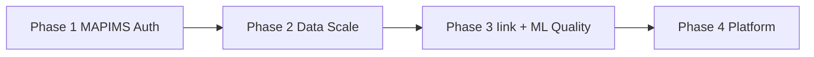

# Learning Roadmap

**Related:** [[Weaknesses]] · [[Skill Matrix]] · [[Engineering Profile]] · [[Security]] · [[AI Engineering]]

---

## Purpose

Close gaps from **Iink + MAPIMS** without diluting core strengths: applied AI pipelines, workflow systems, performance from measurement, hospital/education domain shipping.

---

## Phase 1 — MAPIMS Security & Trust (0–6 weeks)

**Goal:** Safe on hospital LAN beyond trusted kiosk assumption.

| Item | Outcome | Links |
|------|---------|-------|
| JWT or httpOnly session cookie | API receives credentials | [[Security]] |
| Express auth middleware | All mutations protected | [[Backend Engineering]] |
| Role middleware admin/hod/staff | Server mirrors RouteGuards | [[API Design]] |
| Rate limit login + POST feedback | Abuse resistance | [[Security]] |
| Audit log assign/status/delete | Ops accountability | [[Database Engineering]] |
| Vitest: mergeFeedbackLists, cache key | First automated tests | [[Weaknesses]] |

---

## Phase 2 — Data Scale & API Maturity (4–10 weeks)

**Goal:** Hospital-wide feedback volume without multi-MB list responses.

| Item | Outcome |
|------|---------|
| Cursor pagination on `GET /feedback` | Bounded responses |
| Server-side ticket-only endpoint | `/api/tickets` not full feedback |
| sessionStorage cache hydrate | Survive hard refresh |
| Stream multer uploads to disk | RAM stability |
| Split `index.js` routers | feedback, users, catalog, admin |
| OpenAPI spec generation | Contract for frontend |
| Mongo TLS + auth in compose | Production hygiene |

**Skills gained:** API design ★★★★ → ★★★★★, Scalability ★★★★ → ★★★★★

---

## Phase 3 — AI Quality Systems (2–5 months)

**Goal:** Know when prompts/rules regress.

### MAPIMS
| Item | Outcome |
|------|---------|
| Golden set 30 Tamil/English feedbacks | Expected issues + sentiment |
| Regression script post prompt change | CI gate |
| OpenRouter latency/error metrics | Dashboard or log aggregation |
| TMS integration or remove schema fields | Clear product boundary |

### Iink
| Item | Outcome |
|------|---------|
| Golden PDF pages | Layout tag expectations |
| Salvage rate tracking | Prompt health signal |
| Direct crop pipeline | Remove base64 inject |

**Skills gained:** ML evaluation ★★ → ★★★★

---

## Phase 4 — Platform Maturity (6–12 months)

**Goal:** Multi-engineer maintainability.

| Track | Items |
|-------|-------|
| **Testing** | Playwright kiosk submit; API integration tests |
| **CI** | GitHub Actions: lint, vitest, docker build |
| **Observability** | Structured JSON logs, request_id, basic metrics |
| **Iink** | Job queue for OCR; deprecate Flask |
| **Optional AI** | RAG over resolved tickets for admin search — only if product asks |

**Skills gained:** DevOps ★★★ → ★★★★, Testing ★★ → ★★★★

---

## MAPIMS-Specific Next Steps (From Recent Work)

Items directly continuing current trajectory:

1. **Persist Insights filters** in sessionStorage — UX consistency across tab switch
2. **Shared `useFeedbackList` hook** — AdminPage, Tickets, Insights dedupe
3. **Backend ticket list endpoint** — filter `ticketId exists` server-side
4. **Auth + assignedToUserId enforcement** — reject HOD querying without own id
5. **Complete TMS or delete fields** — schema honesty

---

## Iink-Specific Next Steps (Parallel)

1. Auth all `/api/project/{id}/*` routes
2. Path traversal fix on file serve
3. pytest smoke for `text_ocr`, `pipeline_steps`

---

## Recommended Reading

| Topic | Why for your profile |
|-------|---------------------|
| OWASP API Security Top 10 | MAPIMS auth gap |
| Designing Data-Intensive Applications | Delta sync, hybrid storage evolution |
| OpenRouter rate limits & caching docs | Cost control at hospital volume |
| Offline-first patterns (IndexedDB) | Extend outbox patterns |
| FastAPI/Express middleware patterns | Unified auth layer mental model |

---

## What NOT to Prioritize Now

- Microservices split before auth + pagination prove need
- Kubernetes before Docker compose stable in hospital deploy
- Vector DB / RAG before search is product requirement
- Fine-tuning before prompt + lite API exhaust gains
- Rewriting React to Next.js — current SPA + nginx works

---

## Weekly Practice (Maintain Strengths)

1. **One Network tab audit** — any page >500KB JSON?
2. **One hospital user path walkthrough** — kiosk → ticket → HOD
3. **One security or test commit**
4. **One prompt/settings experiment** with logged before/after
5. **Update this vault** when architectural decision made

---

## Vault Navigation

| Note | Use when |
|------|----------|
| [[Engineering Profile]] | Onboarding |
| [[Performance]] | Slow page report |
| [[Debugging]] | Incident response |
| [[Security]] | Pre-deploy review |
| [[Weaknesses]] | Sprint planning |
| [[AI Engineering]] | Changing OpenRouter prompts or split logic |

---

*Updated by UNIVERSO — sources: Iink + MAPIMS Feedback System (`feedbacksystem`). Revise as systems evolve.*
