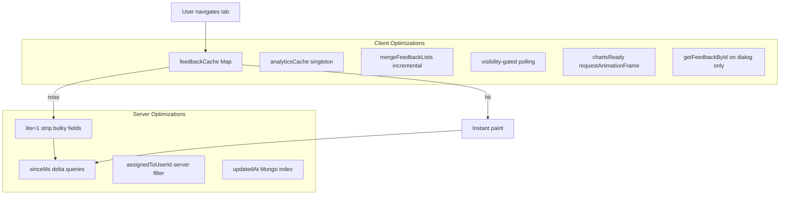
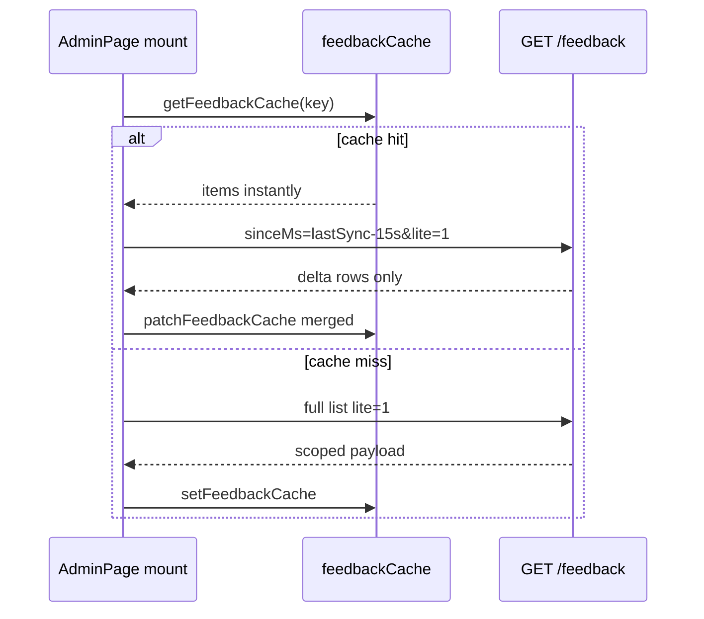

# Performance Engineering

**Related:** [[AI Engineering]] · [[Software Architecture]] · [[Backend Engineering]] · [[Weaknesses]]

---

## Performance Philosophy — Unified

Optimize where **users measure pain**:

| Project | Primary pain | Primary fix |
|---------|--------------|-------------|
| Iink | OCR seconds, GPU OOM | VRAM tiers, cache, vLLM parallel |
| MAPIMS | Multi-MB JSON reload, tab remount | lite API, module cache, delta sync |

Accept monolithic files if **hot paths are tunable** via env, query params, or extracted lib modules.

---

## MAPIMS Performance Stack

---

## Payload Reduction — MAPIMS (Measured Iteration)

Observed from production debugging (Network tab driven):

| Stage | Payload | Trigger |
|-------|---------|---------|
| Original full feedback | ~8–11 MB | All bot transcripts in list |
| `lite=1` | ~5 MB | Still large `comments` text |
| Strip comments when aiSummary | ~KB–low MB | List rows |
| `sinceMs` delta | KB | Tab return / poll |
| HOD `assignedToUserId` | KB | 2 tickets not 8000 rows |

**Key insight:** Row count ≠ payload size — **one Tamil bot session** can be megabytes in `comments`.

---

## Caching Layers — MAPIMS

| Layer | Scope | Invalidation |
|-------|-------|--------------|
| `feedbackCache` Map | Browser session (module singleton) | Tab refresh loses; remount retains |
| `analyticsCache` | Browser session | Same |
| `patchFeedbackCache` | After merge/delete | Manual patch on mutations |
| HTTP cache | Disabled `no-store` | Intentional — app cache owns freshness |
| Mongo query | Server | N/A — stateless API |

**Cache key:** `JSON.stringify({ startMs, endMs, encounter, lite, assignedToUserId })`

**Not used:** Redis, service worker for API cache (SW only for offline submit sync).

---

## Incremental Sync Semantics

**Overlap 15s:** Handles server/client clock skew — pragmatic distributed systems lite.

---

## Polling Strategy — MAPIMS

| Page | Interval | Gate |
|------|----------|------|
| AdminPage analytics | 60s | `document.visibilityState === 'visible'` |
| AdminPage feedback | 60s incremental | visible |
| AdminTicketsPage | 30s incremental | visible |
| Focus/visibility | analytics refresh | window events |

**Why not poll when hidden:** Saves server load and laptop battery — ops-aware frontend perf.

---

## Deferred & Background Work — MAPIMS

| Work | When | User impact |
|------|------|-------------|
| OpenRouter analysis | After 201 response | Submit feels instant |
| `pendingAiWorker` | 45s poll default | Backfill missed AI |
| `repairSplitTickets` | Once per tickets page session | Small POST upfront |
| Excel "download all" | On button click only | Not on page load |

---

## Iink Performance (Retained)

| Technique | Effect |
|-----------|--------|
| VRAM-tier pixel caps | Prevent OOM |
| OCR disk cache + fingerprint | Skip re-inference |
| vLLM parallel pages | Throughput |
| Greedy decode | Faster JSON |
| SSE keepalive | Detect hangs |
| rAF stream paint batching | UI thread relief |

---

## Database & API — MAPIMS

- Indexes on `createdAt`, `updatedAt`, `patientEncounterType` compound
- Sort by `_id` desc (insertion order) — avoids skew from synthetic dates
- `enrichFeedbackListWithGroupDonor` — read path cost; traded for storage dedup
- Analytics endpoint separate from feedback bulk — charts don't need transcripts

---

## Resource Management — MAPIMS Risks

| Issue | Current | Opportunity |
|-------|---------|-------------|
| Multer memory storage | Full file in RAM | Stream to disk |
| `server.timeout = 0` | Never timeout | Risk slowloris |
| No pagination on list API | Full window in one response | Cursor pagination |
| Recharts on mount | rAF defer helps | lazy import charts route |
| In-memory cache unbounded | One entry per query key | LRU cap |

---

## Optimization Opportunities

**MAPIMS:**
1. Server-side pagination for admin table
2. Persist cache to `sessionStorage` for hard refresh
3. Stream uploads to disk
4. Auth middleware + rate limit (security + perf)
5. Code-split insights dashboards (`React.lazy`)

**Iink:**
1. Skip base64 inject in layout pipeline
2. Job queue for OCR
3. Strip `image_data` from saved layout JSON

See [[Weaknesses]] and [[Learning Roadmap]].
