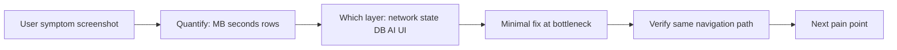

# Problem Solving

**Related:** [[Engineering Profile]] · [[Debugging]] · [[AI Engineering]] · [[Weaknesses]]

---

## Approach to Unknown Problems



You **bias toward shipping fixes** on the critical path over architectural purity — but fixes are **evidence-led**, not guess-led.

---

## Task Decomposition — MAPIMS (Observed)

| Large goal | Subtasks shipped |
|------------|------------------|
| App too slow | Network analysis → `lite=1` → incremental `sinceMs` → client cache → HOD server filter |
| Tab reload pain | `feedbackCache.ts` → silent incremental → `hasData` loading gate |
| Overview charts blank | `analyticsCache.ts` → split loadFeedback vs loadAnalytics |
| HOD sees all tickets | `visibleToHod()` assignee-only → API `assignedToUserId` |
| Split → separate tickets | child Feedback rows → flat ticket groups → repair endpoint |
| HOD dept OR service | schema XOR validation → AdminUsers UI radio → hodRouting |
| Table shows transcript | `ticketAiSummaryForItem` → line-clamp → detail on View |
| Offline kiosk | IndexedDB outbox → service worker → clientSubmissionId idempotency |

**Pattern:** Vertical slice per **user-visible outcome**, then harden edge cases (repair scripts, overlap window).

---

## Task Decomposition — Iink (Retained)

| Large goal | Subtasks |
|------------|----------|
| Text-only OCR | `text_ocr.py`, pipeline skip, studio toggles |
| RBAC workflow | Mongo fields, guards, React queue, baseline copies |
| Performance | vLLM parallel, stream paint batching |
| Remove PaddleOCR | Extractor swap |

---

## Prioritization Heuristics — Unified

1. **Blocks user entirely** — auth, submit fail, 8 MB hang
2. **Wrong data / wrong access** — HOD visibility, split tickets
3. **Speed after correctness** — cache, delta, lite
4. **UX polish** — AI summary in table, chart defer
5. **Debt** — auth middleware, tests, split index.js

You accept **temporary dual paths** (client filter + server filter) if users unblocked immediately.

---

## Experimentation Style

| Technique | MAPIMS | Iink |
|-----------|--------|------|
| Query param toggles | `lite`, `sinceMs` | N/A |
| Env toggles | OpenRouter model, poll intervals | VRAM, greedy, parallel |
| Module extract when repeat | feedbackCache, feedbackListSync | pipeline_steps |
| Repair POST as experiment reset | repair-split-children | force_process |
| Docker rebuild verify | `compose up --build` | entrypoint restart |

Low ceremony — no feature flag service.

---

## Iteration Loop — MAPIMS Performance Case Study

```mermaid
cycle
    title MAPIMS load time iteration
    "User: slow Insights tab" --> "Network: 8MB feedback x3"
    "Network: 8MB feedback x3" --> "Add lite + date scope"
    "Add lite + date scope" --> "Still reload on tab switch"
    "Still reload on tab switch" --> "Add feedbackCache + sinceMs"
    "Add feedbackCache + sinceMs" --> "Overview charts empty"
    "Overview charts empty" --> "Add analyticsCache"
    "Add analyticsCache" --> "Tickets page same issue"
    "Tickets page same issue" --> "Cache AdminTicketsPage"
```

Human-in-the-loop: **user screenshots** drive each cycle — embedded evaluation.

---

## Handling Ambiguity

**MAPIMS examples:**
- "Slow with 2 tickets" → actually downloading all feedback — clarify with Network evidence
- HOD assignment dept vs service → implement XOR rule + admin UI radio
- Comments vs summary in table → product call: summary in list, full in detail

**Iink examples:**
- Text-only vs layout modes → `isTextOnlyOcrActive` detection + UI banners

---

## Collaboration & Process Signals

- Karpathy-style rules in `.cursor/rules/` — think before coding, surgical changes
- Conversation-driven iteration with screenshot evidence
- Docker deploy as verification step
- Maintenance scripts for data repair — ops mindset

---

## Anti-Patterns Consciously Accepted

| Pattern | When rational |
|---------|---------------|
| God file (`index.js`) | Hospital deadline; extract later |
| Frontend-only auth | Prototype phase; LAN deploy assumption |
| Module cache vs React Query | Simpler; no new dependency |
| Memory multer uploads | Faster to implement |
| No tests | Speed; manual hospital UAT |

See [[Weaknesses]] for when to outgrow each.
