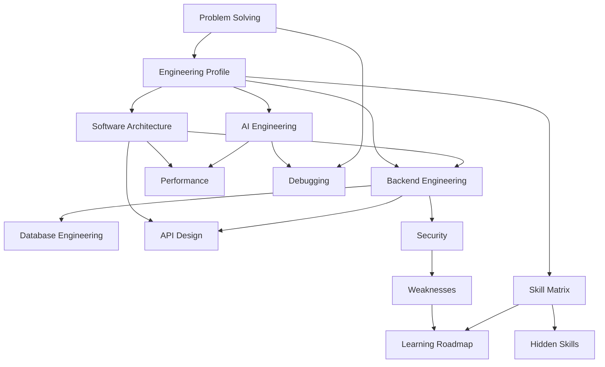

# Engineering DNA — Index

> Obsidian vault reverse-engineered by **UNIVERSO** from two production codebases:
> **Iink** (document OCR / VL pipeline) and **MAPIMS Feedback System** (hospital patient feedback + AI tickets).

Open [[Engineering Profile]] first for the complete narrative.

---

## Vault Map

---

## Files

| Note | Focus |
|------|-------|
| [[Engineering Profile]] | Mindset, dual-project signature, replication guide |
| [[Software Architecture]] | Monolith patterns, hybrid storage, folder WHY |
| [[AI Engineering]] | VL OCR + LLM feedback analysis + STT |
| [[Backend Engineering]] | FastAPI/Express, auth, deferred jobs |
| [[Database Engineering]] | Mongo + FS, indexes, split-ticket schema |
| [[API Design]] | REST, SSE, lite/delta query params |
| [[Performance]] | GPU tiers, cache, incremental sync |
| [[Security]] | RBAC intent vs execution gaps |
| [[Debugging]] | Network tab, artifacts, bisection |
| [[Problem Solving]] | Vertical slices, perf iteration |
| [[Hidden Skills]] | Cross-domain capabilities |
| [[Weaknesses]] | Debt + actionable fixes |
| [[Skill Matrix]] | Star ratings (both projects) |
| [[Learning Roadmap]] | 4-phase growth plan |

---

## Source Repositories

| Project | Path | Domain |
|---------|------|--------|
| **Iink** | `/run/media/durga/New Volume/Iink` | Textbook OCR, VL layout, editorial workflow |
| **MAPIMS Feedback** | `/home/durga/Desktop/PROJECT_MAPIMS/feedbacksystem` | Hospital feedback, AI tickets, Tamil bot, EMR lookup |

**MAPIMS key paths:**
- `backend/src/index.js`, `models.js`, `openRouterAnalysis.js`, `pendingAiWorker.js`
- `backend/src/emrPatientLookup.js`, `feedbackIssueProcessing.js`, `insightsFeedbackQuery.js`
- `frontend/src/app/lib/feedbackCache.ts`, `feedbackListSync.ts`, `feedbackOutbox/`
- `frontend/src/app/components/insights/`, `AdminPage.tsx`, `AdminTicketsPage.tsx`, `Dashboard.tsx`

**Iink key paths:**
- `server.py`, `iink_engine/*`, `project_manager.py`, `dots.mocr/`

---

## Cross-Project Themes

Both codebases share the same engineer fingerprint:

1. **Applied AI over research** — ship pipelines, not papers
2. **Monolith-first** — extract modules when reuse appears, not before
3. **Hybrid persistence** — Mongo metadata + filesystem for heavy blobs
4. **Settings/env toggles** — behavior change without rewrites
5. **Human-in-the-loop** — editorial review (Iink) / HOD tickets (MAPIMS)
6. **Performance from measurement** — Network tab, processing logs, payload size
7. **Pragmatic security** — RBAC designed; API hardening often deferred

---

## How to Use This Vault

1. **Onboard engineers** → Profile + Architecture + relevant AI note
2. **MAPIMS perf incident** → Performance + Debugging + API Design
3. **Iink OCR incident** → Debugging + AI Engineering + Performance
4. **Security review** → Security + Weaknesses
5. **Planning sprint** → Weaknesses + Learning Roadmap

Cross-links use Obsidian `[[wikilinks]]`.
