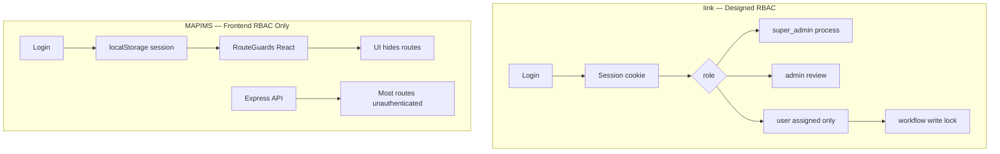

# Security Engineering

**Related:** [[Backend Engineering]] · [[API Design]] · [[Database Engineering]] · [[Weaknesses]]

---

## Security Model Comparison

**Critical gap in MAPIMS:** Authorization exists in **UI guards**, not API middleware.

---

## MAPIMS Authentication

| Aspect | Implementation | Risk |
|--------|----------------|------|
| Mechanism | POST login → JSON stored in localStorage | XSS steals session |
| Password verify | bcrypt server-side | Good |
| Session expiry | None | Stale forever |
| API credentials | No token sent on fetch | Anyone can call API directly |
| Logout | Clear localStorage | Server unaware |

---

## MAPIMS Authorization (Intended)

| Role | Intended access |
|------|-----------------|
| admin | Full admin panel, insights, users, tickets, settings |
| staff | Patient form + staff queue |
| hod | Dashboard queue — **assigned tickets only** |

**Frontend enforcement:**
- `AdminGuard`, `StaffGuard` in `RouteGuards.tsx`
- `InsightsHub` redirects HOD to `/dashboard`
- `visibleToHod()` — assignee-only visibility
- `assignedToUserId` query param for HOD data fetch

**Backend enforcement:** Partial — HOD filter only when query param passed; no role check on param.

---

## Iink Authorization (Stronger Reference)

- `_require_project_access(project_id, write, allow_process)`
- `require_roles` on destructive routes
- Workflow blocks user writes when submitted
- Audit log append

**MAPIMS should mirror:** JWT or session cookie + `requireRole('admin')` middleware on `/api/users`, `/api/feedback/*` mutations, repair/seed endpoints.

---

## Secrets Management — MAPIMS

| Secret | Handling |
|--------|----------|
| `OPENROUTER_API_KEY` | backend `.env` |
| `SARVAM_API_KEY` | backend `.env` |
| `EMR_COOKIE` | backend `.env` — hospital session cookie |
| Seed user passwords | `.env.example` placeholders |
| Mongo URI | Docker compose — **no auth in default compose** |

---

## Input Validation — MAPIMS

**Present:**
- Enum whitelists (role, status, encounter type)
- String length caps
- ObjectId validation
- HOD dept XOR service rule
- Multer file size limits

**Missing:**
- Schema validation library (Zod/Joi)
- Rate limiting on login
- CSRF protection
- Content-Type enforcement beyond multer
- Sanitization of HTML in stored comments (display uses React text — XSS mitigated in UI)

---

## Injection & Threats — MAPIMS

| Threat | Status |
|--------|--------|
| NoSQL injection | Low — typed filters, ObjectId conversion |
| SQL injection | N/A Mongo; EMR SQL built server-side with sanitized dates |
| Unauthenticated API abuse | **High** — list/delete/repair open |
| IDOR on feedback/:id | **High** — no ownership check |
| Open maintenance endpoints | **High** — repair-split-children, seed |
| Admin bot config writable | **High** — `/api/admin/bot-conversation` |
| Path traversal uploads | Medium — IDs from Mongo ObjectId |
| CORS | Configurable `FEEDBACK_CORS_ORIGINS` for uploads |

---

## Offline / Client Security — MAPIMS

**feedbackOutbox (IndexedDB):**
- Queues submissions when offline — good UX
- `clientSubmissionId` idempotency — prevents duplicate server rows
- Service worker sync — background retry

**Risk:** Outbox stores full payload client-side — device access = data access (kiosk hardening needed).

---

## Secure Practices Present — MAPIMS

- bcrypt password hashing
- Password hash never returned in login response
- `lite` API reduces accidental data exposure in list views
- HOD server-side filter reduces over-fetch (not authorization)

## Actionable Hardening — MAPIMS (Priority)

1. **JWT or session cookie** — send on every API request
2. **Auth middleware** — all `/api/*` except health, login, public bot config read
3. **Role middleware** — admin-only on users, settings, repair, seed
4. **Rate limit** login + feedback POST
5. **Mongo auth + TLS** in production compose
6. **Session expiry** + refresh
7. **Audit log** — ticket assign, status change, delete (Iink pattern)

See [[Weaknesses]] for sprint ordering.
