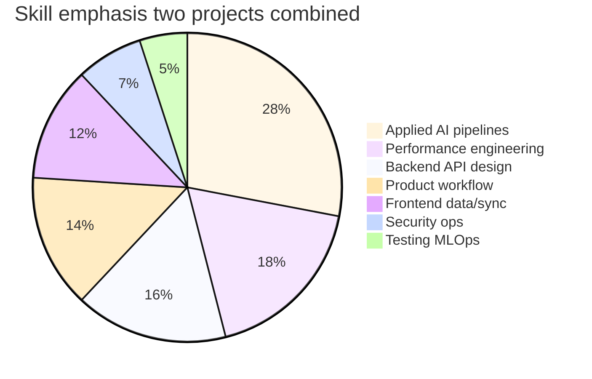

# Skill Matrix

**Related:** [[Hidden Skills]] · [[Engineering Profile]] · [[Weaknesses]] · [[Learning Roadmap]]

Rating key:
- ★★★★★ Expert — novel solutions; could teach
- ★★★★ Advanced — production patterns; some gaps
- ★★★ Intermediate — functional; inconsistent depth
- ★★ Beginner — exposure only
- ★ Basic — minimal evidence

Evidence column cites **both projects** where applicable.

---

## Core Engineering

| Skill | Rating | Evidence |
|-------|:------:|----------|
| Software architecture | ★★★★ | Iink engine package; MAPIMS lib extraction + god file tension |
| System design | ★★★★ | SSE OCR; lite/delta API; offline outbox; not multi-region |
| Backend engineering | ★★★★ | FastAPI + Express; deferred workers both |
| API design | ★★★★ | Iink SSE; MAPIMS lite/sinceMs/detail split; auth gaps |
| Database design | ★★★★ | MAPIMS indexes + split schema; Iink embedded arrays |
| Code organization | ★★★ | Clear lib folders; monolith route files |
| Modularity | ★★★ | Extract on reuse; orchestration still leaky |
| Maintainability | ★★★ | Settings/env help; zero tests hurt |
| Documentation | ★★★ | env.example, this vault; sparse in-repo ADRs |
| Technical writing | ★★★★ | Prompts, EMR comments, Engineering DNA |

---

## AI / ML

| Skill | Rating | Evidence |
|-------|:------:|----------|
| AI engineering (applied) | ★★★★★ | Iink VL OCR product; MAPIMS LLM triage + split tickets |
| ML engineering | ★★★★ | Inference opt Iink; deferred worker MAPIMS; no training |
| Computer vision | ★★★★ | Iink PDF raster, crops, region OCR |
| NLP / document AI | ★★★★ | Iink layout IR; MAPIMS Tamil STT + summarization |
| Prompt engineering | ★★★★★ | Iink layout prompts; MAPIMS compact XML JSON-only |
| Speech / voice AI | ★★★★ | MAPIMS Sarvam STT, bot pipeline, voice rating |
| RAG | ★ | Not present either project |
| Agents / tool use | ★ | Not present |
| Embeddings / vector DB | ★ | Not present |
| Model evaluation | ★★ | Human review; maintenance scripts; no metrics CI |
| Inference optimization | ★★★★★ | Iink GPU tiers; MAPIMS payload + defer + lite |

---

## Frontend Engineering

| Skill | Rating | Evidence |
|-------|:------:|----------|
| React architecture | ★★★★ | Router guards, outlet context, hooks — no global store |
| Client performance | ★★★★★ | feedbackCache, incremental sync, visibility poll — MAPIMS |
| Offline-first UX | ★★★★ | IndexedDB outbox + service worker |
| TypeScript | ★★★ | Used throughout; no tsconfig strict project |
| UI component systems | ★★★ | shadcn/Radix — implementation not primary signature |

---

## Operations & Quality

| Skill | Rating | Evidence |
|-------|:------:|----------|
| Performance engineering | ★★★★★ | GPU Iink + network payload MAPIMS |
| Security engineering | ★★★ | Iink RBAC designed; MAPIMS execution gap |
| DevOps / Docker | ★★★★ | Both compose; MAPIMS nginx; no CI |
| Testing / QA automation | ★★ | Manual UAT; zero unit tests |
| Debugging | ★★★★★ | Network-tab-driven MAPIMS; artifact Iink |
| Observability | ★★★ | Console tags, processing logs; no APM |

---

## Integration & Domain

| Skill | Rating | Evidence |
|-------|:------:|----------|
| Enterprise integration | ★★★★ | EMR QueryBuilder SOAP |
| Healthcare domain | ★★★★ | OP/IP, UHID, HOD routing, tickets |
| Editorial workflow | ★★★★★ | Iink submit/review/revert |
| Bilingual systems | ★★★★ | Tamil bot + prompt rules |

---

## Product & Process

| Skill | Rating | Evidence |
|-------|:------:|----------|
| Product thinking | ★★★★ | Three surfaces MAPIMS; role workflow Iink |
| Problem decomposition | ★★★★★ | Performance iteration MAPIMS case study |
| Automation | ★★★ | Workers, repair scripts, SW sync |
| Scalability thinking | ★★★★ | vLLM offload; lite/delta; knows pagination gap |

---

## Radar Summary

---

## Strongest Differentiators

1. **End-to-end applied AI** — VL OCR (Iink) + LLM triage/tickets (MAPIMS)
2. **Performance from measurement** — GPU tiers AND megabyte payload discipline
3. **Workflow-embedded systems** — editorial + hospital ticket ops
4. **Legacy integration** — EMR SOAP without over-engineering ETL
5. **Bilingual voice feedback** — Tamil STT + bot + LLM analysis chain

## Fastest Upside Areas

1. API auth middleware (MAPIMS critical)
2. Vitest for mergeFeedbackLists + cache key logic
3. Pagination on list endpoints
4. Iink auth route coverage
5. Prompt regression golden set (both projects)

See [[Learning Roadmap]].
