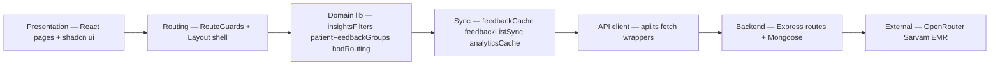

# Software Architecture

**Related:** [[Engineering Profile]] · [[Backend Engineering]] · [[AI Engineering]] · [[API Design]] · [[Performance]]

---

## Dual System Context

```mermaid
flowchart TB
    subgraph iink [Iink — Document OCR]
        React1[React Dashboard]
        Studio[Jinja Studio]
        FastAPI[server.py]
        Engine[iink_engine]
        Mongo1[(Mongo metadata)]
        FS1[projects/ artifacts]
        GPU[Local GPU / vLLM]
    end

    subgraph mapims [MAPIMS — Hospital Feedback]
        React2[React SPA Vite]
        Nginx[nginx static]
        Express[index.js Express 5]
        Mongo2[(MongoDB)]
        Uploads[/uploads voice]
        OR[OpenRouter LLM]
        STT[Sarvam STT]
        EMR[EMR QueryBuilder]
    end

    React1 --> FastAPI --> Engine --> Mongo1 & FS1 --> GPU
    Studio --> FastAPI
    React2 --> Nginx --> Express --> Mongo2 & Uploads
    Express --> OR & STT & EMR
```

---

## MAPIMS Folder Organization — WHY

| Path | Responsibility | Rationale |
|------|----------------|-----------|
| `backend/src/index.js` | All HTTP routes + orchestration | Single deployable unit; hospital IT runs one container |
| `backend/src/models.js` | Mongoose schemas | One file — schemas co-evolve with routes |
| `backend/src/openRouter*.js` | LLM client + prompts | Token-budget prompts separated from route noise |
| `backend/src/feedbackIssueProcessing.js` | Tickets, signatures, split logic | Reused by create path + repair scripts |
| `backend/src/pendingAiWorker.js` | Background AI poller | Decouple OpenRouter latency from submit response |
| `backend/src/emrPatientLookup.js` | EMR SOAP integration | Hospital-specific; isolated for test script |
| `backend/src/insightsFeedbackQuery.js` | Mongo filter builder | Shared filter for list + delta queries |
| `frontend/src/app/routes.tsx` | All routes + guards | Single router tree; role nests clear |
| `frontend/src/app/lib/` | Domain logic without React | Testable; cache survives component unmount |
| `frontend/src/app/lib/feedbackOutbox/` | Offline IndexedDB sync | Kiosk reliability separate from admin UI |
| `frontend/src/app/components/insights/` | Insights hub + dashboards | Outlet context pattern — one data hook, many views |

**Pattern:** *Extract lib modules when the same query/cache logic serves Admin + Insights + Tickets.*

---

## Iink Folder Organization — WHY

| Path | Responsibility | Rationale |
|------|----------------|-----------|
| `iink_engine/` | OCR, layout, export | Importable package shared by Flask + FastAPI |
| `project_manager.py` | Project CRUD + workflow FS | Persistence separated from HTTP |
| `projects/` | Per-project artifacts | Large binaries off Mongo |
| `server.py` | HTTP + SSE orchestration | Thin where possible; thick where product evolved |

See prior Iink analysis in this vault — still valid.

---

## Layered Architecture — MAPIMS



**Not strict clean architecture** — `Dashboard.tsx` still embeds table markup; acceptable for admin CRUD velocity.

---

## Design Patterns — Both Projects

| Pattern | Iink | MAPIMS | Why |
|---------|------|--------|-----|
| **Facade** | `ocr_runtime` | `fetchFeedbackList` + cache layer | Hide backend/query complexity |
| **Cache-aside** | `page_N.json` fingerprint | `feedbackCache` Map | Avoid repeat expensive fetch |
| **Write-through patch** | layout save | `patchFeedbackCache` on merge/delete | Keep cache coherent |
| **Deferred work** | SSE thread | `setImmediate` + `pendingAiWorker` | Fast user response |
| **Strategy** | Matcher 15+ strategies | Heuristic dept → OpenRouter hint resolve | Domain rules before LLM |
| **State machine** | `workflow_status` | ticket `status` New/In Progress/Resolved | Ops lifecycle |
| **Split aggregate** | chunk ranges | `isSplitChild` + `submissionGroupId` | One submission, many actionable rows |
| **Donor enrichment** | N/A | `enrichFeedbackWithGroupDonor` | Children inherit parent voice/bot at read |
| **Idempotency** | `force_process` | `clientSubmissionId` partial unique index | Offline retry safe |
| **Outlet context** | N/A | `InsightsHub` → child routes | Share filters without prop drilling |

---

## Configuration Management — MAPIMS

**Two-tier:**

1. **Environment** — `OPENROUTER_*`, `SARVAM_*`, `EMR_*`, `MONGODB_URI`, Docker compose
2. **Mongo `Branding` + `BotConversationConfig`** — colors, voice limits, bot questions (admin-editable)

**Startup self-healing:** `repairClientSubmissionIds()`, `repairMissingSplitVoiceRecordings()`, `ensureDefaults()` — data fixes on boot, not migration framework.

---

## Separation of Concerns — MAPIMS Strengths

- AI analysis ≠ ticket materialization ≠ HTTP routes (partially split)
- List query filters in `insightsFeedbackQuery.js`
- HOD routing rules in `hodRouting.ts` (frontend) + `assignedToUserId` filter (backend)
- Offline sync isolated in `feedbackOutbox/`

## Separation — MAPIMS Tensions

- `index.js` ~2,625 lines — create feedback handler alone is massive
- Duplicate route aliases (`/api/departments` vs `/api/hospital-departments`)
- Auth designed in frontend guards only — backend has no middleware layer
- TMS fields in schema with stub integration

---

## Scalability Architecture — MAPIMS (Current)

- **Vertical:** Single Node process; multer memory storage up to 60–80 MB per upload
- **Not horizontal:** No Redis; in-memory frontend cache is per browser tab session
- **Read optimization path:** `lite`, `sinceMs`, `assignedToUserId`, Mongo indexes on `createdAt`/`updatedAt`
- **Write path:** Synchronous AI on some paths; deferred on others — mixed

See [[Performance]] and [[Weaknesses]].
