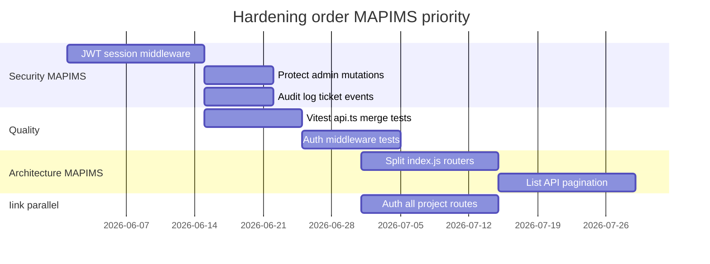

# Weaknesses & Technical Debt

**Related:** [[Security]] · [[Skill Matrix]] · [[Learning Roadmap]] · [[Engineering Profile]]

---

## Architecture Limitations

### Iink
| Issue | Impact |
|-------|--------|
| Monolithic `server.py` | Hard to test/navigate |
| Dual Flask + FastAPI | Security drift |
| Single uvicorn worker | API blocked during CPU work |

### MAPIMS
| Issue | Impact |
|-------|--------|
| Monolithic `index.js` ~2625 lines | Same as Iink god file |
| No backend auth middleware | API callable without login |
| Multer memory storage | RAM spike on 60MB voice upload |
| In-memory frontend cache | Lost on full page reload |
| TMS schema without integration | Confusing dead fields |
| No list pagination | Full date window in one response |

---

## Code Smells — MAPIMS

| Smell | Location | Fix |
|-------|----------|-----|
| God route file | `index.js` | Extract routers: auth, feedback, admin, catalog |
| Duplicate dept routes | `/departments` vs `/hospital-departments` | Deprecate one |
| Client + server HOD filter | Dashboard | Server-only with auth |
| `loadData` duplication | AdminPage vs useInsightsData | Shared hook |
| Repair on every tickets load | AdminTicketsPage first visit | Admin-triggered only |
| eslint-disable exhaustive-deps | Multiple useEffects | Stable deps or explicit mount-only comment |

---

## Code Smells — Iink (Retained)

| Smell | Fix |
|-------|-----|
| `layout_export.py` god module | Split crops/export/alt-text |
| Full user collection replace | Per-user upsert |
| Unauthenticated file routes | Uniform Depends |

---

## Missing Best Practices — Both

| Gap | Iink | MAPIMS |
|-----|------|--------|
| Automated tests | None | None |
| Request validation library | No Pydantic on main API | No Zod |
| API auth on all routes | Partial | **Critical gap** |
| CI pipeline | None | None |
| OpenAPI spec | None | None |
| Structured logging | traceback only | console tags only |
| tsconfig.json | N/A | Missing in frontend |

---

## Scalability Risks — MAPIMS

1. Full feedback list for admin tickets (all time, lite) — still large at hospital scale
2. `enrichFeedbackListWithGroupDonor` — O(n) read amplification on list
3. Unbounded `feedbackCache` Map keys per query variant
4. Single Node process — CPU bound on concurrent uploads + AI
5. No Mongo replica/sharding strategy

---

## Security Gaps — Prioritized (MAPIMS)

1. **No API authentication** — critical for any public network
2. Open repair/seed endpoints
3. Admin bot config writable without auth
4. localStorage session — XSS exposure
5. Mongo without auth in default Docker
6. No rate limiting on login or POST feedback
7. No audit trail for ticket assign/delete

See [[Security]] for remediation detail.

---

## ML / Quality Gaps

### Iink
- No golden-set OCR regression
- No layout IoU metrics

### MAPIMS
- No prompt regression suite for Tamil split accuracy
- No monitoring of OpenRouter failure rate / latency
- Sentiment misclassification caught only in ops review
- `pendingAiWorker` silent failures — console only

---

## Documentation Gaps

- MAPIMS frontend README outdated
- No ADR folder in repos (this vault compensates externally)
- TMS integration undocumented (stub)
- EMR setup requires tribal knowledge (`EMR_COOKIE`, date order)

---

## Debt Already Being Paid Down — MAPIMS

Recent iteration (evidence in codebase):
- `lite=1` list contract
- `updatedAt` index + `sinceMs` delta
- `feedbackCache` + `analyticsCache`
- HOD `assignedToUserId` server filter
- Split child materialization + repair endpoint
- AI summary in HOD table vs full comments
- Insights loading gate `hasData`
- Admin chart rAF defer

---

## Actionable 90-Day Improvements — Unified

See [[Learning Roadmap]].
