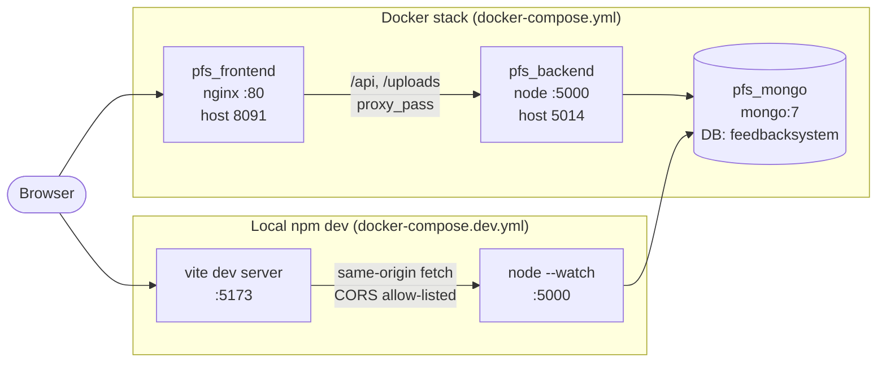
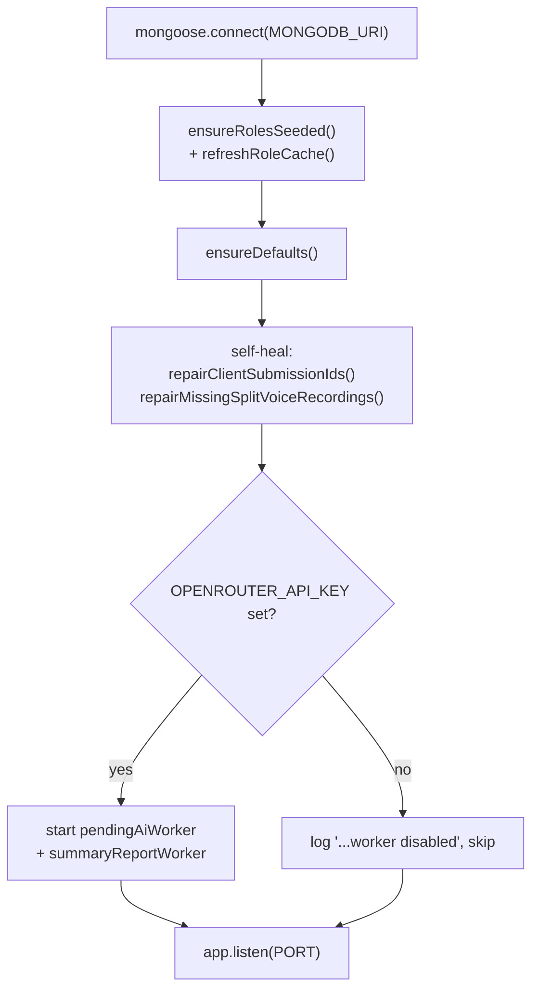
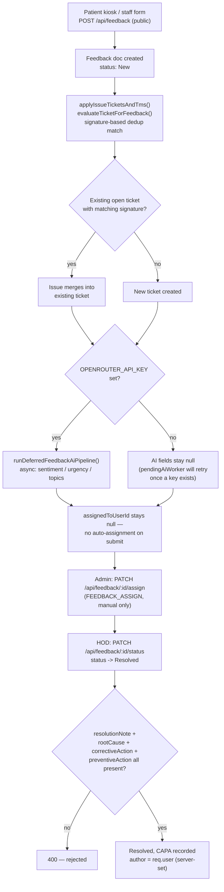
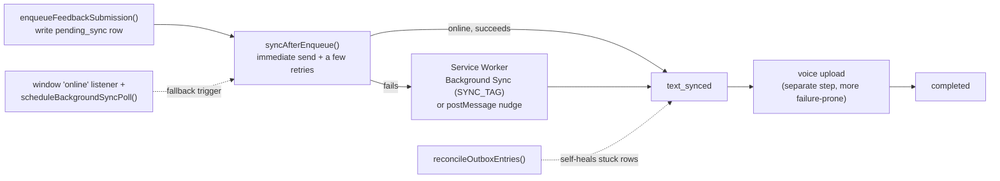

# PFS — Architecture

**Date:** 2026-09-02
**Scope:** Patient Feedback System — backend (Express/Mongoose) + frontend
(React/Vite) + deployment (Docker Compose)
**Basis:** Read directly from `backend/src/`, `frontend/src/app/`,
`docker-compose*.yml`, `Dockerfile`s and `nginx.conf` on `main`. File:line
references point at the code this describes.

---

## 1. System topology

Two independent stacks can run against the same underlying app, and are both
live in this repo's dev setup — worth knowing before debugging "it works here
but not there":

- `pfs_mongo` is the **single** Mongo container either stack talks to, but they
  point at **different databases inside it**: the Docker backend uses
  `mongodb://mongodb:27017/feedbacksystem` (service-name DNS, internal to the
  `pfs_net` bridge network, `docker-compose.yml:31`); the local npm backend
  uses `mongodb://127.0.0.1:27017/feedbacksystem_remote` (`backend/.env`,
  reachable only because `docker-compose.dev.yml` publishes 27017 to the
  host). **Data does not match between the two** unless that's deliberately
  reconciled.
- The Docker frontend is a static Vite build served by nginx; the local
  frontend is Vite's own dev server with HMR. Both proxy `/api` and
  `/uploads` to the backend rather than calling it cross-origin.

---

## 2. Backend (`backend/src/`)

| File | Role |
|---|---|
| `index.js` (~3,200 lines) | The Express app — every route, startup sequence |
| `models.js` | All Mongoose schemas |
| `auth.js` | JWT issue/verify, `requireAuth` middleware |
| `roles.js` | Role seeding + in-memory role→capability cache |
| `capabilities.js` | The capability vocabulary (single source of truth) |
| `botConversation.js` | Voice/bot Q&A intake flow |
| `pendingAiWorker.js` | Retries AI analysis for un-analyzed feedback |
| `summaryReportScheduler.js` | Generates periodic summary reports |
| `openRouterAnalysis.js` | OpenRouter (LLM) client for sentiment/urgency/topic tagging |

### 2.1 Startup sequence (`startServer`, `index.js:3156-3199`)

The role cache **must** populate before traffic — every capability check
(§3) reads it synchronously, not the database, per request. Server timeouts
are set to 0 (unbounded); the nginx layer in front is what actually bounds
request time (§5.3).

### 2.2 Route inventory (grouped by domain)

| Domain | Routes | Guard |
|---|---|---|
| Health/misc | `GET /api/health`, `POST /api/speech-to-text` | none / `requireAuth` |
| Auth | `POST /api/auth/login`, `POST /api/auth/change-password` | public / `requireAuth` |
| Catalog | `GET/POST/PATCH/DELETE /api/departments`, `/api/hospital-departments`, `/api/services` (`:966-1200`) | GET: `requireAuth` · writes: `DEPARTMENTS_MANAGE`/`SERVICES_MANAGE` |
| Users | `GET/POST/PATCH/DELETE /api/users` (`:1279-1448`) | GET: `requireAuth` · writes: `USERS_MANAGE` |
| Roles | `GET/PATCH /api/roles` (`:1448-1459`) | `ROLES_MANAGE` |
| Maintenance | `POST /api/seed/open-negative-tickets`, `POST /api/feedback/repair-split-children` (`:1508-1554`) | `MAINTENANCE_RUN` |
| Patient intake | `POST /api/patient/lookup`, `POST /api/feedback/infer-voice-rating` (`:1554-1589`) | public |
| Feedback submit | `POST /api/feedback` (`:2095`), `POST /api/feedback/:id/voice-recording` (`:2557`) | public (patient kiosk) |
| Feedback read | `GET /api/feedback` (`:2608`, **unbounded — no `limit`/`skip`**), `GET /api/feedback/:id` (`:2632`) | `requireAuth` |
| Insights | `GET /api/analytics` (`:2675`), `GET /api/summary-reports*` (`:2797-2850`) | `INSIGHTS_VIEW` / `REPORTS_GENERATE` |
| Ticket lifecycle | `PATCH /api/feedback/:id/status` (`:2872`, the CAPA gate — §2.4), `PATCH /api/feedback/:id/assign` (`:2995`), `DELETE /api/feedback/:id` (`:3059`) | `FEEDBACK_RESOLVE` / `FEEDBACK_ASSIGN` / `FEEDBACK_DELETE` |
| Branding | `GET/PUT/DELETE /api/branding` (`:3072-3133`) | writes: `BRANDING_MANAGE` |
| Bot conversation | registered separately by `registerBotConversationRoutes()` | `SETTINGS_MANAGE` for admin config |

### 2.3 Auth & RBAC

- **JWT**: `signAuthToken` embeds only `{ sub, username, role }` —
  capabilities are **not** in the token. `attachUser` re-resolves
  `capabilitiesForRole(role)` from the live role cache on every request, so a
  permission change takes effect on the user's *next request*, not next
  login. `getJwtSecret()` refuses to boot in `NODE_ENV=production` without
  `JWT_SECRET` set; dev falls back to an ephemeral random secret (logs
  everyone out on restart).
- **Roles are data**, not a code enum — stored in the `Role` collection,
  seeded once at boot (existing rows never overwritten, so edits persist),
  mirrored into an in-process `Map` for synchronous per-request checks.
  `superadmin` is `isProtected: true` and always resolves to the full
  capability set regardless of what's stored in the database, so the RBAC
  admin screen can never lock every admin out.
- **Capabilities** (`capabilities.js`): 15 flat strings
  (`feedback.read.all`, `feedback.assign`, `capa.write`, `insights.view`,
  `users.manage`, `roles.manage`, `maintenance.run`, …). `requireCapability(...)`
  = must hold **all** listed; `requireAnyCapability` = at least one.
- **CORS**: deny-by-default except same-origin/no-`Origin` requests and
  `localhost`/`127.0.0.1` dev hosts (`buildCorsOptions`).

Default role → capability bundles (`roles.js` `DEFAULT_ROLES`, `:19-81`):

| Role | Capabilities | Practical meaning |
|---|---|---|
| `superadmin` | *all* (protected) | Full control, incl. role/permission management |
| `management` | `FEEDBACK_READ_ALL`, `INSIGHTS_VIEW`, `REPORTS_GENERATE` | Read-only executive dashboards |
| `admin` | `FEEDBACK_READ_ALL/ASSIGN/DELETE`, `INSIGHTS_VIEW`, `REPORTS_GENERATE`, `USERS_MANAGE`, `DEPARTMENTS_MANAGE`, `SERVICES_MANAGE`, `SETTINGS_MANAGE`, `BRANDING_MANAGE`, `MAINTENANCE_RUN` | Day-to-day operator — notably **not** `ROLES_MANAGE` |
| `hod` | `FEEDBACK_READ_ASSIGNED`, `FEEDBACK_RESOLVE`, `CAPA_WRITE` | Owns only their assigned queue |
| `staff` | `FEEDBACK_READ_ALL`, `INSIGHTS_VIEW` | Submits on patients' behalf, read-only otherwise |

### 2.4 The CAPA gate

`PATCH /api/feedback/:id/status` (`index.js:2872-2904`) is the one place
policy is enforced server-side rather than left to the UI: a transition to
`status: "Resolved"` requires a non-empty `resolutionNote` **and** all three
of `rootCause`, `correctiveAction`, `preventiveAction`, or the request is
rejected with 400. The CAPA author (`writtenByUserId`/`writtenByUsername`) is
taken from `req.user`, never the request body, so attribution can't be
spoofed. A caller without `FEEDBACK_READ_ALL` (a scoped HOD) can only act on
tickets already assigned to themselves (`:2912-2917`).

### 2.5 Background workers & external integrations

- **`pendingAiWorker`** / **`summaryReportWorker`** — both gated on
  `process.env.OPENROUTER_API_KEY` being set (`isEnabled` check at startup);
  both currently disabled in this environment (`[pending-ai] worker disabled`
  / `[summary-report] worker disabled` in boot logs). While disabled,
  `aiSentiment`/`aiUrgency`/`aiTopics`/`aiSummary` never populate on new
  feedback and never retroactively backfill.
- **OpenRouter** (LLM): referenced at `index.js:1939, 2201, 2226, 2254, 2349,
  2421, 2495, 3175, 3180` — sentiment/urgency/topic tagging and summary
  narrative generation, all conditional on the same env var.
- **TMS (Task Management System)**: `docker-compose.yml` declares
  `TMS_API_URL`, `TMS_EMP_ID`, `TMS_PASSWORD`, `TMS_FEEDBACK_DEPARTMENT_ID`,
  `TMS_FEEDBACK_CATEGORY_ID`, `TMS_FEEDBACK_SUBCATEGORY_ID`,
  `TMS_FEEDBACK_PRIORITY`, `TMS_CLIENT_URL`, and the `Feedback` schema has
  matching `tmsTicketId`/`tmsTicketNumber`/`tmsTicketUrl`/`tmsSyncedAt`/
  `tmsSyncError` fields — but **no route or worker in `backend/src` ever
  reads those env vars or writes those fields**. This is reserved/dead
  wiring, not a live integration; don't describe it as one in
  user-facing docs without re-verifying against the code at that time.

---

## 3. Feedback lifecycle (the core data flow)

Two things worth flagging explicitly because they explain observed
production numbers (see `document/UPGRADE.md` §1 for the measured figures):
**nothing auto-assigns a ticket to a HOD at submission time** — step K is
always a manual admin action, even though `frontend/src/app/lib/hodRouting.ts`
already has the department/service-name canonicalization logic
(`normKey()`) that could drive it — and **the AI pipeline is a no-op** in any
environment without `OPENROUTER_API_KEY`, silently, with no UI indicator.

### 3.1 Voice/bot intake (a parallel path, not a separate system)

`botConversation.js` drives a config-driven Q&A flow: an admin-editable
`BotConversationConfig` doc (intro text/audio + ordered `questions[]`,
`GET/PUT /api/admin/bot-conversation`, `SETTINGS_MANAGE`). Answers land as
`feedback.botConversationAnswers[]` (question, transcript, audio path,
per-answer sentiment) **on the same `Feedback` model**, not a separate
collection — `submissionMode: "bot"` is what distinguishes it downstream.
Per-answer sentiment resolves in order: existing tag → matching AI issue's
sentiment → overall fallback (`attachBotAnswerSentimentsFromIssues`,
`botConversation.js:164`). From the ticket-creation step onward (§3, step C
on), it rejoins the same flow as a standard submission.

Voice recordings for both paths are files on disk under the backend's
`uploadsRoot`, persisted via the `pfs_uploads_data` Docker volume, referenced
by relative path, and streamed back through nginx's `/uploads/*` block (§5.3)
— they are not stored in Mongo.

### 3.2 Offline outbox (patient kiosk resilience)

`frontend/src/app/lib/feedbackOutbox/` is an IndexedDB-backed queue
(`feedback-outbox` DB) that lets the kiosk keep accepting submissions through
flaky hospital wifi:

Entries progress `pending_sync → text_synced → completed`; voice upload is
deliberately a separate step after the text record exists server-side, since
large audio is the more failure-prone part of the two.

---

## 4. Frontend (`frontend/src/app/`)

### 4.1 Route guarding

`routes.tsx` gates the tree with the **same 15 capability strings** as the
backend (`CAPABILITY` constant in `RouteGuards.tsx`), but this is a
hand-duplicated copy, not an import from the backend — a drift risk to watch
if `capabilities.js` ever changes. `StaffGuard` = any signed-in session.
`RequireCapability({anyOf})` gates `/management/*` on `insights.view`.
`AdminGuard` gates `/admin/*` with a per-subpath capability map
(`/admin/users` → `USERS_MANAGE`, `/admin/roles` → `ROLES_MANAGE`, etc.,
`:114-121`), so a deep link into one admin screen still checks that screen's
own capability rather than just "can reach `/admin` at all."
`landingRouteForSession()` (`:77-88`) picks the post-login redirect by
capability priority: `ROLES_MANAGE`/`USERS_MANAGE` → `/admin`, else
`INSIGHTS_VIEW` → `/management/overview`, else
`FEEDBACK_READ_ASSIGNED`/`FEEDBACK_READ_ALL` → `/dashboard`, else the patient
kiosk home. All of this is UX convenience only — the API re-derives and
enforces capabilities from the live role cache on every request (§2.3), so a
tampered client-side session grants nothing.

### 4.2 Page components (top-level)

| Component | Purpose |
|---|---|
| `Dashboard.tsx` | Staff/HOD ticket queue — department/service/combined views, the "Needs attention" triage bar |
| `TicketDetail.tsx` | Single-ticket view — decision rail, CAPA form, timeline |
| `AdminUsersPage.tsx` | User CRUD |
| `AdminRolesPage.tsx` | Role → capability editor |
| `InsightsHub.tsx` + `insights/*` | Management dashboards: Overview, Submissions, Tickets, Sentiment leaderboard |
| `FeedbackForm` / `FeedbackMode` | Patient kiosk submission flow |
| `BotConversationFeedback*` | Voice/bot Q&A intake UI |
| `Layout.tsx` | App shell/nav |
| `LoginPage.tsx` | Auth entry |

### 4.3 `lib/` modules (data & state, not components)

There is no react-query/global-store layer — `lib/api.ts` and
`apiClient.ts` are typed `fetch` wrappers (token-attaching, 401 handling),
and `auth.ts` owns the session. Everything else in `lib/` is
domain logic pulled out of components: `hodRouting.ts` (label
canonicalization — see §3's routing gap), `chartPalette.ts` /
`complaintTopics.ts` / `managementScorecard.ts` / `departmentLabels.ts` /
`insightsFilters.ts` (insights-dashboard support), `feedbackCache.ts` +
`feedbackOutbox/*` (§3.2), plus smaller single-purpose helpers
(`ticketFilters.ts`, `sentiment.ts`, `fieldSanitize.ts`, `pagination.ts`,
`patientFeedbackGroups.ts`, `audioTranscription.ts`, `branding.ts`,
`aiTopicsFilter.ts`, `useNetworkStatus.ts`, `usePatientIdentity.ts`).

---

## 5. Deployment

### 5.1 `docker-compose.yml` (project `pfs`)

| Service | Image/build | Container | Host port | Notes |
|---|---|---|---|---|
| `mongodb` | `mongo:7` | `pfs_mongo` | *(none by default)* | volume `pfs_mongo_data`, DB `feedbacksystem` |
| `backend` | `backend/Dockerfile` | `pfs_backend` | `5014→5000` | `env_file: backend/.env`, volume `pfs_uploads_data:/app/uploads` |
| `frontend` | `frontend/Dockerfile` | `pfs_frontend` | `8091→80` | depends on `backend` |

All three share bridge network `pfs_net`. `docker-compose.dev.yml` is a dev
override that publishes Mongo's `27017` to the host so a local, non-
containerized `npm run dev` backend can reach the same Mongo container
(§1). There is no `HEALTHCHECK` on any service.

### 5.2 Images

- **`backend/Dockerfile`**: `node:20-alpine`, `npm ci --omit=dev`, copies
  source, moves any bundled `uploads/` aside to `uploads-bundled` (so the
  runtime volume mount doesn't collide with seed files), `chmod +x
  docker-entrypoint.sh`. Entrypoint is that shell script — **this file must
  have LF line endings**; a CRLF checkout breaks its `#!/bin/sh` shebang on
  Alpine and crash-loops the container (`exec ./docker-entrypoint.sh: no
  such file or directory`), fixed in this session but worth a `.gitattributes`
  rule (`*.sh text eol=lf`) to prevent recurrence on the next Windows clone.
- **`frontend/Dockerfile`**: two-stage — `node:20-alpine` runs `npm ci &&
  npm run build` (Vite), then `nginx:alpine` serves the static `dist/` with
  the repo's `nginx.conf`.

### 5.3 `frontend/nginx.conf`

SPA fallback (`try_files ... /index.html`), gzip for JS/CSS/JSON, and two
proxy blocks to the backend: `/api` and `/uploads/` — the latter needs its
own explicit block because the default `/` SPA fallback would otherwise
serve `index.html` for a missing static path and silently break `<audio>`
playback of voice recordings. `client_max_body_size 100m` and 600s timeouts
are set specifically to let large voice-recording uploads complete; this is
the effective request-timeout ceiling for the whole app, since the backend
itself sets its own server timeouts to 0 (unbounded).

### 5.4 Environment

`backend/.env` (loaded by `env_file` in the Docker stack, and directly by
`dotenv` in local `npm run dev`) carries `PORT`, `MONGODB_URI`,
`SEED_ADMIN_*`/`SEED_STAFF_*`, `JWT_SECRET`, and optionally
`OPENROUTER_API_KEY`. No `backend/.env.example` currently exists in the repo
(shows as deleted in `git status`) — worth restoring so a fresh clone has a
template to work from.

---

## 6. Known architectural gaps

Not exhaustive — see `document/UPGRADE.md` for the full flow/data-integrity
proposal and `document/UX_ANALYTICS_UPGRADE.md` for the UX/analytics one,
both grounded in measured figures. The structural ones worth carrying into
any change here:

1. **No auto-assignment at submission** (§3) — `hodRouting.ts`'s matching
   logic exists client-side but nothing calls it server-side; every ticket
   waits for a manual admin assign.
2. **`GET /api/feedback` has no pagination** (`index.js:2608`) — grows
   unbounded with the table.
3. **TMS integration is config-only, not wired to any code path** (§2.5) —
   don't build against it as if it's live without re-checking `index.js`.
4. **AI pipeline is fully silent when `OPENROUTER_API_KEY` is unset** — no
   UI indicator that sentiment/urgency/topics will never populate.
5. **Frontend route capability strings are hand-duplicated from the
   backend** (§4.1) — a source of drift if `capabilities.js` changes without
   a matching edit to `RouteGuards.tsx`.
6. **Docker and local-dev backends point at different databases**
   (`feedbacksystem` vs `feedbacksystem_remote`, §1) — a recurring source of
   "works in one, not the other" confusion during development.
