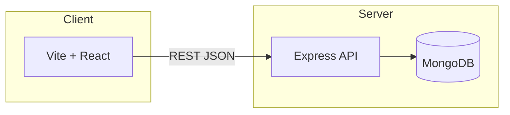

# MAPIMS Feedback System

Hub note for local development and deployment. Use this file inside an [[Obsidian]] vault (same folder structure as the repo, or symlink `document/` into your vault).

## Quick start

```bash
# MongoDB (from repo root)
docker compose up -d

# Backend API
cd backend && npm install && npm run dev
# → http://localhost:5000

# Frontend (separate terminal)
cd frontend && npm install && npm run dev
# → http://localhost:5173
```

Configure `frontend` → `VITE_API_URL` if the API is not same-origin (e.g. `http://localhost:5000`). Backend uses `backend/.env` (`MONGODB_URI`, `PORT`).

---

## Architecture (high level)



---

## Frontend routes (memory aid)

| Path | Purpose |
|------|---------|
| `/` | Login (default entry) |
| `/login` | Same login screen |
| `/welcome` | Patient landing (“Thank you for visiting…”, Give Feedback) |
| `/feedback` | Patient feedback form |
| `/feedback-mode` | Choose feedback method |
| `/thank-you` | After submission |
| `/login` → staff | Staff session → often `/feedback` or dashboards |
| `/admin` | Admin analytics (guard: admin) |
| `/admin/settings` | Theme / branding (saved to DB) |
| `/admin/tickets`, `/admin/users`, `/admin/departments` | Admin modules |

QR codes in admin analytics typically target **`/feedback`** (not `/`).

---

## Backend API (selected)

| Method | Path | Notes |
|--------|------|------|
| GET | `/api/health` | Liveness |
| POST | `/api/auth/login` | `{ username, password }` |
| GET/POST | `/api/feedback` | List / create feedback |
| GET | `/api/analytics` | Dashboard aggregates |
| GET | `/api/branding` | Shared theme (all devices) |
| PUT | `/api/branding` | Update branding |
| DELETE | `/api/branding` | Reset branding defaults |
| GET | `/api/departments` | Departments |
| GET | `/api/users` | Users (no password hash) |
| GET | `/api/tms/health` | TMS connectivity check |
| GET | `/api/tms/departments` | Proxy: TMS department list |
| GET | `/api/tms/tickets` | Proxy: TMS ticket list (query passthrough) |
| GET | `/api/tms/tickets/:id` | Proxy: single TMS ticket |
| POST | `/api/tms/tickets/sync/:feedbackId` | Manually push a feedback to TMS (retry) |

---

## TMS integration (Ticket Management System)

When the four `TMS_*` env vars in `backend/.env` are set, every feedback that triggers a ticket (rating 1, repeated rating 2 within the dedup window, or AI-negative sentiment) is forwarded to the standalone [[TMS]] project as a real ticket. The returned TMS `ticketNumber` replaces the local placeholder, and a clickable TMS link is shown on `Admin → Tickets`.

Operator one-time setup in TMS:

1. Create a department, e.g. "Patient Feedback".
2. Create a `REQUESTER` user assigned to that department. This is the service account.
3. Copy the department `_id` and service-account `empId`/`password` into `backend/.env`:

```
TMS_API_URL=http://localhost:5013
TMS_EMP_ID=...
TMS_PASSWORD=...
TMS_FEEDBACK_DEPARTMENT_ID=...
# Optional: provide all three to skip TMS's Groq classification.
# TMS_FEEDBACK_CATEGORY_ID=...
# TMS_FEEDBACK_SUBCATEGORY_ID=...
# TMS_FEEDBACK_PRIORITY=HIGH
TMS_CLIENT_URL=http://localhost:8090
```

Failures degrade gracefully: a local `TKT-XXXX` id is kept on the Feedback row and `tmsSyncError` is populated, so the admin UI surfaces a "Push to TMS" retry button per row.

---

## Branding

- Stored in **MongoDB** (`Branding` collection), not only in the browser.
- After saving in **Admin → Settings**, phones scanning QR see the same colors/logo once they load the app from your deployed URL.

---

## Demo accounts (seeded when DB is empty)

- Admin: `admin` / `admin123`
- Staff: `staff` / `staff123`

---

## Related notes (create if needed)

- [[MAPIMS Feedback Workflow]] — entry points, ticket rules, vision vs implemented, `/workflow` UI
- [[Docker MongoDB setup]] — link to your compose file or notes
- [[Production deploy]] — reverse proxy, HTTPS, env vars

---

## Repo layout

```
feedbacksystem/
  backend/      # Express + Mongoose
  frontend/     # Vite + React + Tailwind
  document/     # This Obsidian hub (optional vault folder)
```

---

*Last aligned with app behavior: root route opens login; patient home is `/welcome`; branding API persists to DB.*
