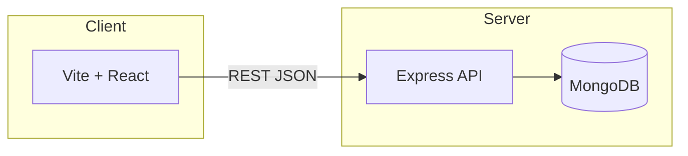

# MAPIMS Feedback System

Hub note for local development and deployment. Use this file inside an [[Obsidian]] vault (same folder structure as the repo, or symlink `document/` into your vault).

## Quick start

```bash
# MongoDB (from repo root)
docker compose up -d

# Backend API
cd backend && npm install && npm run dev
# → http://localhost:5000

# Frontend (separate terminal)
cd frontend && npm install && npm run dev
# → http://localhost:5173
```

Configure `frontend` → `VITE_API_URL` if the API is not same-origin (e.g. `http://localhost:5000`). Backend uses `backend/.env` (`MONGODB_URI`, `PORT`).

---

## Architecture (high level)



---

## Frontend routes (memory aid)

| Path | Purpose |
|------|---------|
| `/` | Login (default entry) |
| `/login` | Same login screen |
| `/welcome` | Patient landing (“Thank you for visiting…”, Give Feedback) |
| `/feedback` | Patient feedback form |
| `/feedback-mode` | Choose feedback method |
| `/thank-you` | After submission |
| `/login` → staff | Staff session → often `/feedback` or dashboards |
| `/admin` | Admin analytics (guard: admin) |
| `/admin/settings` | Theme / branding (saved to DB) |
| `/admin/tickets`, `/admin/users`, `/admin/departments` | Admin modules |

QR codes in admin analytics typically target **`/feedback`** (not `/`).

---

## Backend API (selected)

| Method | Path | Notes |
|--------|------|------|
| GET | `/api/health` | Liveness |
| POST | `/api/auth/login` | `{ username, password }` |
| GET/POST | `/api/feedback` | List / create feedback |
| GET | `/api/analytics` | Dashboard aggregates |
| GET | `/api/branding` | Shared theme (all devices) |
| PUT | `/api/branding` | Update branding |
| DELETE | `/api/branding` | Reset branding defaults |
| GET | `/api/departments` | Departments |
| GET | `/api/users` | Users (no password hash) |

---

## Branding

- Stored in **MongoDB** (`Branding` collection), not only in the browser.
- After saving in **Admin → Settings**, phones scanning QR see the same colors/logo once they load the app from your deployed URL.

---

## Demo accounts (seeded when DB is empty)

- Admin: `admin` / `admin123`
- Staff: `staff` / `staff123`

---

## Related notes (create if needed)

- [[MAPIMS Feedback Workflow]] — entry points, ticket rules, vision vs implemented, `/workflow` UI
- [[Docker MongoDB setup]] — link to your compose file or notes
- [[Production deploy]] — reverse proxy, HTTPS, env vars

---

## Repo layout

```
feedbacksystem/
  backend/      # Express + Mongoose
  frontend/     # Vite + React + Tailwind
  document/     # This Obsidian hub (optional vault folder)
```

---

*Last aligned with app behavior: root route opens login; patient home is `/welcome`; branding API persists to DB.*
