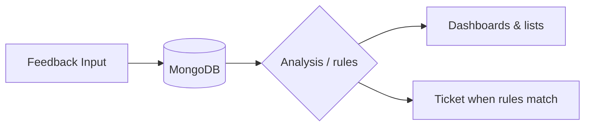
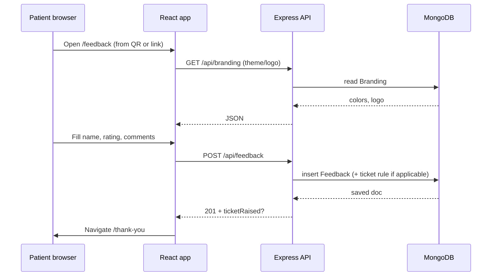
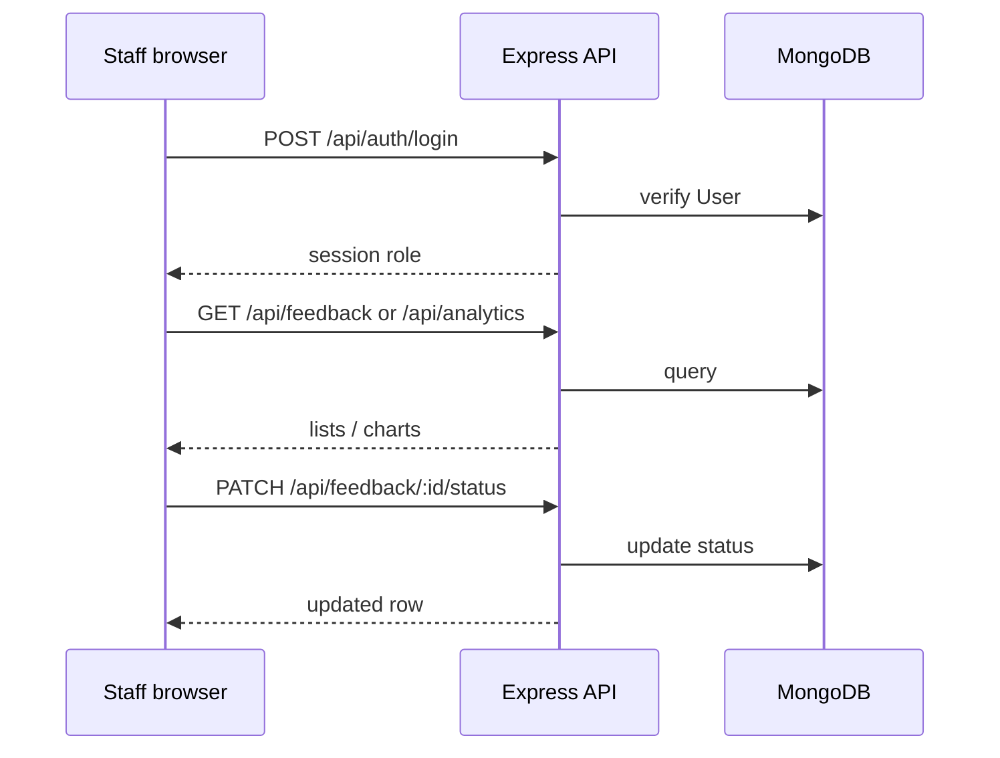

# MAPIMS Feedback Workflow

Companion to [[MAPIMS Feedback System]]. Describes how feedback moves through channels, API, storage, and outcomes—including what the **UI workflow page** illustrates versus what is **currently implemented** in code.

---

## Entry points (feedback input)

| Channel | Typical route | Notes |
|---------|---------------|--------|
| Patient web form | `/feedback` | Emoji rating + optional comments |
| Patient landing | `/welcome` → Give Feedback → `/feedback` | Public flow |
| Staff-assisted | Login as staff → `/feedback` | `source: staff` on submit |
| Other modes (UI) | `/feedback-mode`, voice, paper upload | Routed into same API where wired |

---

## End-to-end pipeline (conceptual)

Matches the **System Flow Visualization** on `/workflow` (staff-guarded):

1. **Feedback input** — Multi-channel capture (web, staff, etc.).
2. **Data storage** — Persisted via `POST /api/feedback` → MongoDB (`Feedback` collection).
3. **Analysis** — Intended: sentiment / NLP (see *Implementation status* below).
4. **Decision / routing** — Intended: smart routing by department/priority (see *Implementation status*).
5. **Outcome** — Status updates, dashboards, tickets, thank-you redirects.

---

## Implemented behavior (today)

### Submit feedback

- Client sends `patientName`, `department`, `rating` (1–5), `comments`, `source` (`patient` \| `staff` \| `ai`).
- Server stores row with `status` default **New**, optional **`ticketId`**, **`complaintSignature`** for grouping similar complaints.

### Complaint ticket rule (automatic)

When **rating ≤ 2** and **comments text is non-empty**, the backend checks prior rows with the same normalized complaint signature (department + comments). If **at least two distinct patient names** have raised the **same signature**, a **`ticketId`** is assigned (existing or newly generated). Related rows can be linked to that ticket.

This is **rule-based**, not a hosted LLM.

### Staff operations

- Admins/staff view feedback and analytics (`/admin`, `/management`).
- Feedback **status** can move: New → In Progress → Resolved via API patch (`/api/feedback/:id/status`).
- Negative-by-department and trends come from **`/api/analytics`**.

---

## Diagram: sentiment branches (UI vision vs code)

The workflow screen shows **automated outcomes by sentiment** (thank-you, Google review prompt, escalation, etc.). Treat that as **product vision** unless you wire each step (email/SMS/Google APIs, cron jobs).

**Rough mapping to today’s product:**

| Branch in UI | Rating proxy (emoji scale) | What exists today |
|--------------|---------------------------|-------------------|
| Positive | 4–5 | Stored; analytics + thank-you **page after submit** (`/thank-you`) |
| Neutral | 3 | Stored; analytics |
| Negative | 2 | Stored; ticket **only when** duplicate-complaint rule fires |
| Critical | 1 | Same ticket rule as negative; **no separate “urgent AI” pipeline** yet |

---

## Detailed outcome matrix (from workflow UI)

These bullets mirror **`WorkflowDiagram.tsx`** for documentation and ops planning:

### Positive (vision)

- Thank-you message sent  
- Review prompt (e.g. Google)  
- Metrics on dashboard  

### Neutral (vision)

- Logged to dashboard  
- Pattern analysis  
- No immediate automated action  

### Negative (vision)

- Complaint ticket concept  
- Assignment / follow-up  

### Critical / urgent (vision)

- Immediate alert  
- Manager notification  
- Priority escalation  

**Implementation gap:** automate notifications, assignments, and external review links as separate integrations when you prioritize them.

---

## AI-powered intelligence (declared features)

The workflow page lists three intelligence themes:

| Theme | Intent |
|--------|--------|
| Sentiment analysis | Infer emotion / urgency from text |
| Keyword extraction | Topics / complaint categories |
| Smart routing | Route to department + priority |

**Implementation status:** Not fully replaced by an external AI service in this repo snapshot; enhancement path is to call an LLM or NLP service after `POST /api/feedback` or in batch jobs, then persist tags on each document.

---

## Related routes

| Path | Role |
|------|------|
| `/workflow` | Staff-protected workflow diagram |

---

## Sequence: patient submits feedback

---

## Sequence: staff reviews and resolves

---

## Branding flow (shared with QR phones)

On each full page load, the layout loads **`GET /api/branding`** so patient and admin UIs share the same primary color, background, and optional logo from MongoDB—no per-device-only storage for the canonical theme.

See [[MAPIMS Feedback System]] → Branding.

---

## Roadmap: toward “AI-based” feedback (phases)

Use this as a checklist in Obsidian; link tasks to your project board if you use one.

| Phase | Scope | Suggested touchpoints |
|-------|--------|------------------------|
| **1 — Structure** | Store `sentiment`, `topics[]`, `priority` on `Feedback` | Extend Mongoose schema + migration script for old docs |
| **2 — Rules first** | Keyword lists + rating thresholds before paying for LLM | Run in `POST /api/feedback` after insert |
| **3 — LLM** | Call OpenAI/Gemini/etc. for summary + tags | Env `AI_API_KEY`, timeout, redact PHI per policy |
| **4 — Ops** | Email/Slack on critical, digest emails | Worker or serverless + queue |

---

## Complaint signature (quick reference)

For duplicate detection the backend builds something like:

`normalizedDepartment + "|" + normalizedComments`

So two **different people** reporting the **same issue text** (and department) can trigger a **shared `ticketId`** when ratings are low enough (see server code). This is the main **automated “decision”** today before any AI layer.

---

## See also

- [[MAPIMS Feedback System]] — setup, routes, APIs, branding  
- Backend: `Feedback` schema, `POST /api/feedback`, ticket logic in `backend/src/index.js`  
- Frontend: `WorkflowDiagram.tsx`

---

*Keep this note in Obsidian beside `MAPIMS Feedback System.md` for linked graph navigation.*
